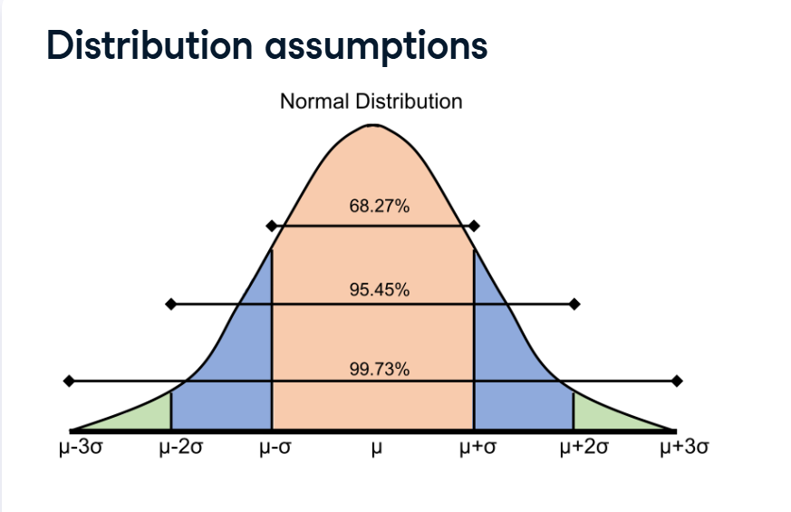
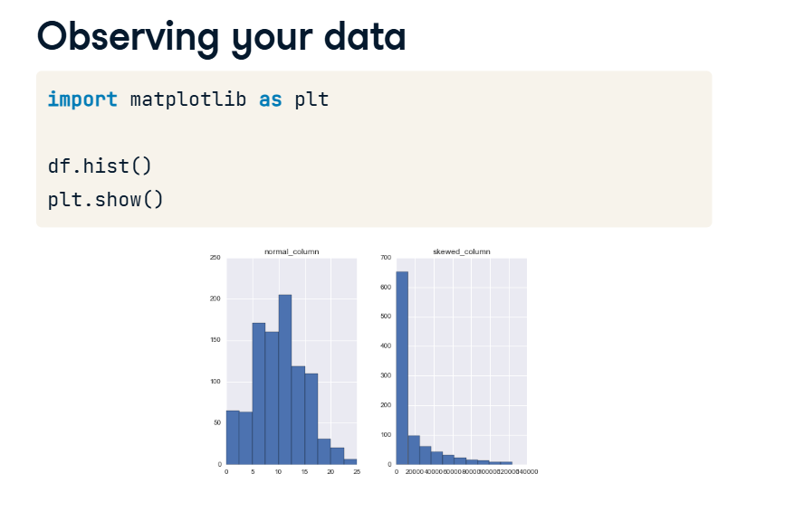
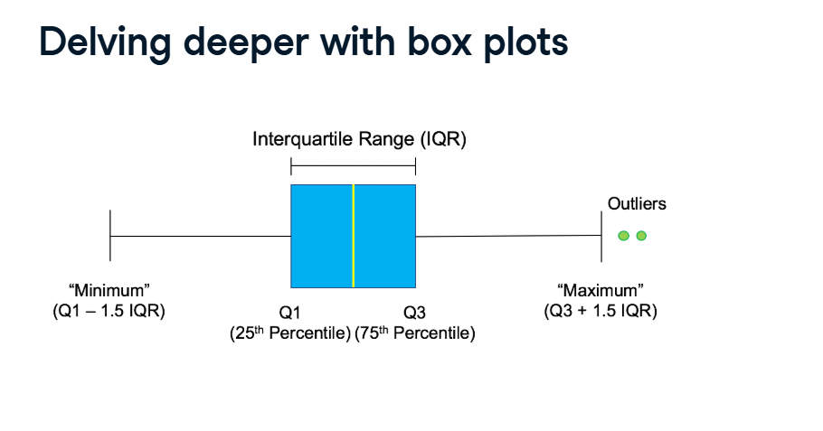
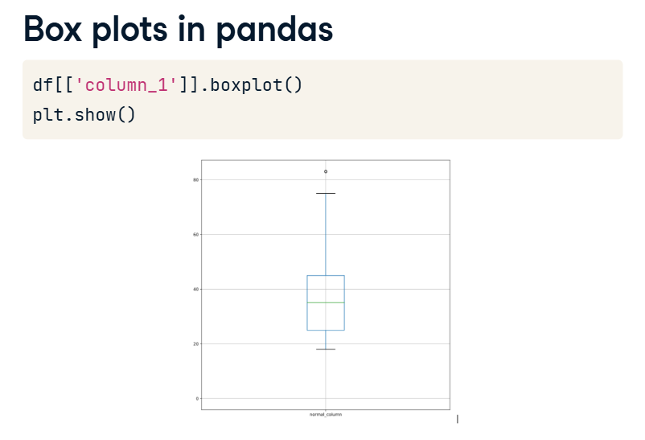
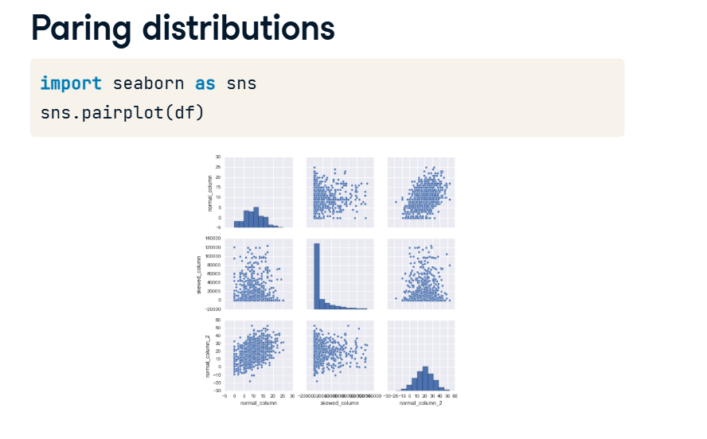
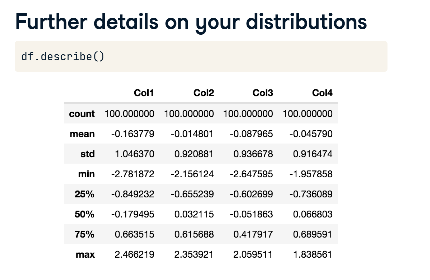

# Data Distributions

Before you start building machine learning models, you have to look at the "shape" of your data.

Why? Because almost every machine learning model (except for Decision Trees and Random Forests) is mathematically picky. They strictly assume that your data follows a very specific, perfect shape. If your data is lopsided, the model will get confused and make bad predictions.

Here is how we check the shape of our data and spot any problems!

## 1. The "Perfect" Shape: The Normal Distribution



Look at your Distribution assumptions screenshot. This is the Normal Distribution, commonly known as a Bell Curve.

This is the exact shape that most machine learning models expect to see. It assumes that most of your data is perfectly average, and extreme numbers are very rare.
*(Example: Most adult men are around 5'9". Very few are 5'0", and very few are 6'6". If you graph their heights, it forms a perfect bell shape!)*

**The 68-95-99.7 Rule:**
The math behind a perfect bell curve is highly predictable based on Standard Deviations (the average spread of the data):
*   68% of all your data falls right in the middle (within 1 standard deviation).
*   95% falls within 2 standard deviations.
*   99.7% falls within 3 standard deviations. (Anything outside of this is considered an extreme outlier!).

## 2. Checking the Shape: Histograms (`df.hist()`)

How do you know if your dataset actually looks like a bell curve? You draw a Histogram.



Look at your Observing your data screenshot.
*   **The Left Graph:** This looks like a beautiful, symmetrical mountain. The data is nicely centered. Models will love this!
*   **The Right Graph:** This data is Skewed. All the data is bunched up on the left side, with a long, thin tail dragging out to the right. (This is called a "Right Tail" or "Right Skew"). Linear models will struggle with this column unless you fix it!

**The Code:**
```python
import matplotlib.pyplot as plt

# Tell Pandas to draw histograms for all numerical columns
df.hist()
plt.show()
```

## 3. Zooming in on the Middle: Box Plots

Histograms are great for the overall shape, but they make it hard to pinpoint exact outliers. For that, we use a Box Plot.



Look at the Delving deeper with box plots screenshot. It looks like a box with two lines (whiskers) sticking out.

*   **The Box (The IQR):** The box represents the Interquartile Range (IQR). This is where the exact middle 50% of your data lives. It ignores the extremes and focuses on the most "typical" rows.
*   **The Whiskers:** These lines reach out to grab the rest of the normal data (usually up to 1.5 times the size of the box).
*   **The Dots (Outliers):** Any data point that sits completely outside the whiskers is drawn as an individual dot. These are your mathematical Outliers!

**The Code:**
```python
# Tell Pandas to draw a boxplot for one specific column
df.boxplot(column=['my_column_name'])
plt.show()
```

## 4. Comparing Columns: The Pairplot

Histograms and Box Plots only look at one column at a time. What if you want to see if two columns interact with each other?



Look at your Paring distributions screenshot. We use a Pairplot from the Seaborn library.
It instantly draws a massive grid comparing every single feature against every other feature.

*   If the dots look like a random cloud, the two columns have no relationship.
*   If the dots form a diagonal line (like the top-right box in the image), the two columns are highly correlated!

**The Code:**
```python
import seaborn as sns

# Draw a scatterplot grid for every combination of columns!
sns.pairplot(df)
plt.show()
```

## 5. The Math Summary (`describe()`)

Finally, if you don't want to look at graphs and just want the raw numbers, you can use Pandas' trusty `describe()` method.

```python
print(df.describe())
```




As shown in your last screenshot, this instantly prints out the exact Mean, Minimum, Maximum, and the Quartiles (the 25%, 50%, and 75% marks that make up the Box Plot!) so you can evaluate the spread of your data mathematically!
