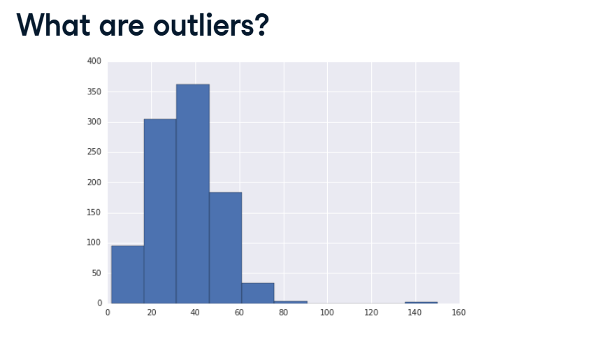
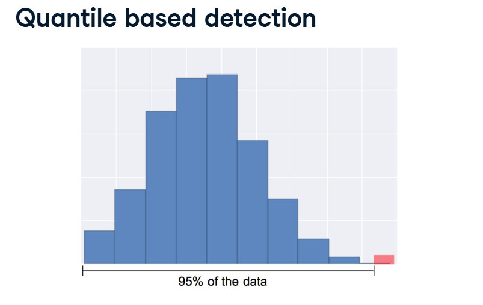
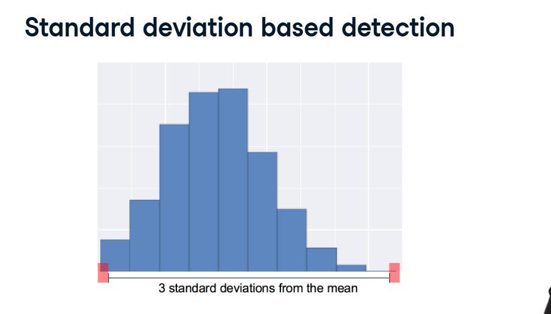

# Removing Outliers

Even if you scale your data or fix missing values, your dataset might still have a terrible shape because of Outliers.

## 1. What are Outliers?



Look at your What are outliers? screenshot.
Outliers are extreme data points that exist far, far away from the majority of your normal data.

**Why do they happen?** Sometimes it is a typo (someone accidentally typed an age of 900 instead of 90). Sometimes it is a genuine rare event (a billionaire in a list of normal salaries).

**Why are they dangerous?** If you use Min-Max Scaling on a dataset with a billionaire, the billionaire becomes 1.0, and every normal person gets horribly squished down to 0.00001. The outlier completely hijacks the math and breaks the model!

Here are the two ways we remove them.

## 2. Approach A: Quantile-Based Detection (The "Percentage" Chop)



Look at your Quantile based detection and Quantiles in Python screenshots.

If you don't want to do complicated math, you can just tell the computer: "I want to completely chop off the top 5% of the data, no matter what."

*   **The Quantile:** The 95th quantile is the exact number where 95% of your data sits below it, and 5% sits above it.
*   **The Danger:** This method is blind. If your data is actually perfectly healthy and has no outliers, this method will still ruthlessly delete the top 5% of your perfectly good data!

**The Pandas Code:**

```python
# 1. Find the 95th quantile (the cutoff line for the top 5%)
cutoff = df['my_column'].quantile(0.95)

# 2. Create a VIP Mask: Only keep rows where the number is strictly BELOW the cutoff!
mask = df['my_column'] < cutoff

# 3. Apply the mask to shrink the dataset
df_cleaned = df[mask]
```

## 3. Approach B: Standard Deviation Detection (The "3-Sigma" Rule)



Look at your Standard deviation based detection and Standard deviation detection in Python screenshots.

This is the much smarter, mathematically sound way to do it. Instead of blindly chopping off the top 5%, we calculate the Mean (Average) and the Standard Deviation (the normal, healthy spread of the data).

A famous rule in statistics states that 99.7% of all normal, healthy data will fall within 3 Standard Deviations of the average. Anything outside of those bounds is genuinely weird and should be thrown out.

*   **The Benefit:** If your data is perfectly healthy, this method won't delete anything! It only deletes data that is mathematically proven to be an extreme anomaly.

**The Pandas Code:**

```python
# 1. Calculate the Average and the Spread
mean_val = df['my_column'].mean()
std_val = df['my_column'].std()

# 2. Calculate the safe boundaries (The Upper and Lower Limits)
lower_bound = mean_val - (3 * std_val)
upper_bound = mean_val + (3 * std_val)

# 3. Create a VIP Mask: Only keep rows that fall safely inside the boundaries!
mask = (df['my_column'] > lower_bound) & (df['my_column'] < upper_bound)

# 4. Apply the mask to shrink the dataset
df_cleaned = df[mask]
```

By removing these extreme outliers, your distributions will look much more like normal bell curves, and your machine learning models will be much more stable and accurate!
