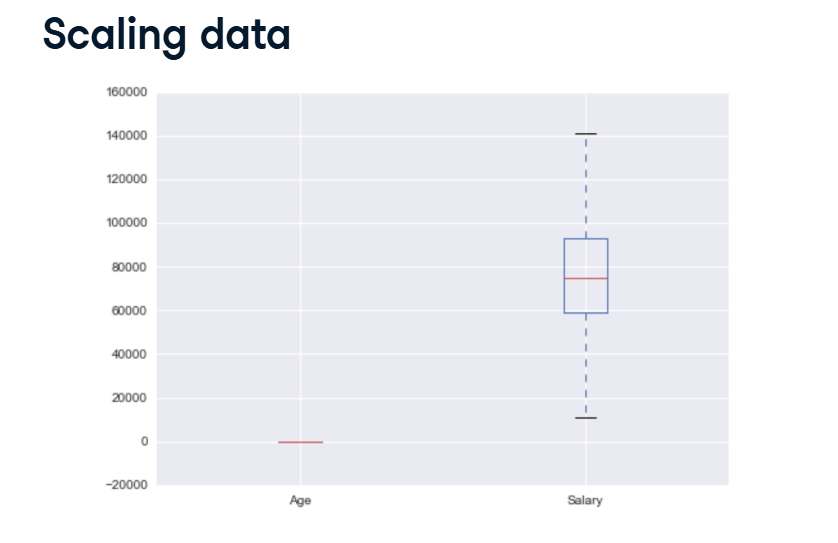
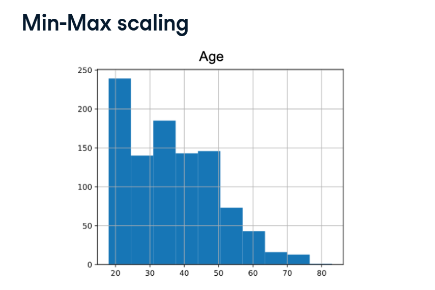
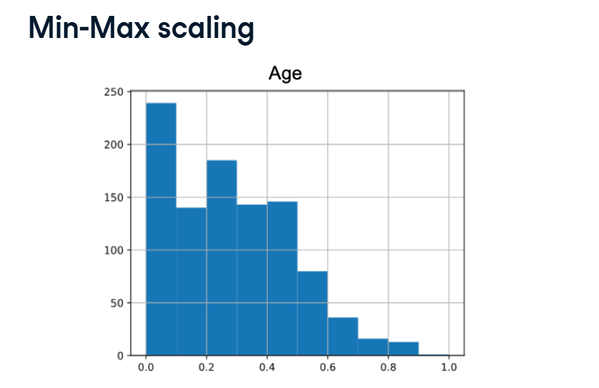
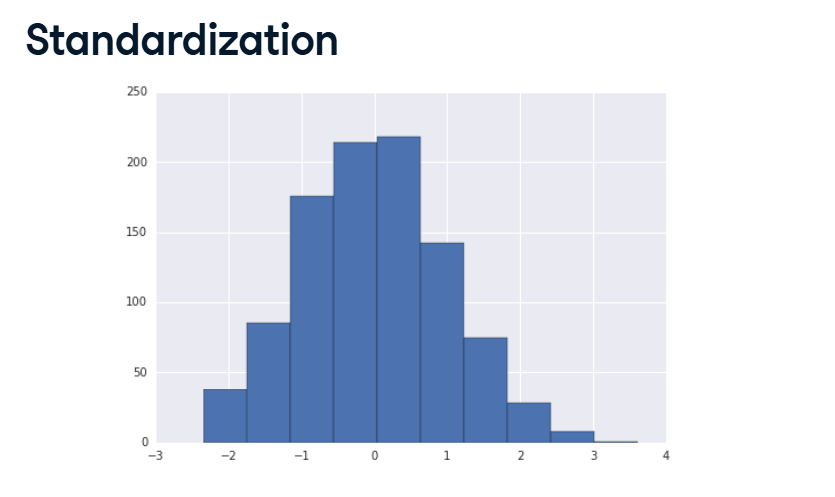
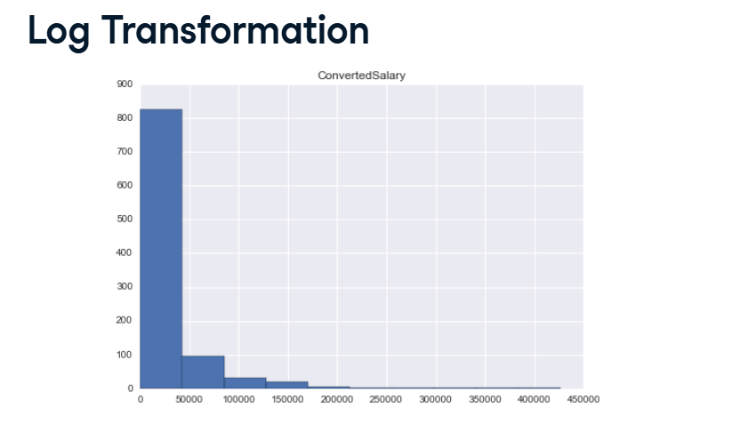

# Scaling and Transformations

In the real world, data comes in all shapes and sizes.



Look at the Scaling data screenshot. Imagine you have a dataset with a person's Age (e.g., 30 years old) and their Salary (e.g., $85,000).
Because $85,000 is a massively larger number than 30, a machine learning model will get confused. It will assume that Salary is thousands of times more important than Age, simply because the number is bigger.

To fix this, we have to put all our features on a level playing field. We do this using Scaling and Transformations.

## 1. Min-Max Scaling (The "Squish" Method)



**What it does:** Min-Max scaling takes your entire column of data and literally squishes it into a tiny box between 0 and 1.
*   The absolute smallest number in your dataset becomes exactly 0.0.
*   The absolute largest number becomes exactly 1.0.
*   Everything else is spaced out perfectly in between.

**The Visual Result:** Look at the graphs in your images. Before scaling, the Age axis goes from 20 to 80. After scaling, the shape of the data looks exactly the same, but the X-axis now goes from 0.0 to 1.0!

**How to code it:**



```python
from sklearn.preprocessing import MinMaxScaler

# 1. Instantiate the tool
scaler = MinMaxScaler()

# 2. Fit the tool (It finds the Min and Max of your data)
scaler.fit(df[['Age']])

# 3. Transform the data (Squish it between 0 and 1!)
df['normalized_age'] = scaler.transform(df[['Age']])
```

*(Warning: If you get a brand new customer later who is 100 years old, they will break the 0-to-1 boundary because the model thought 80 was the absolute maximum!)*

## 2. Standardization (The "Centering" Method)

**What it does:** Instead of trapping data in a strict 0-to-1 box, Standardization focuses on the Average (Mean).
It takes the exact average of your dataset and moves it to exactly 0. Then, it measures every other data point by asking: "How many standard deviations away from the average are you?"

**The Visual Result:** Unlike Min-Max scaling, Standardization has no hard limits. You might see numbers like -2.5 (well below average) or +3.1 (well above average).

**How to code it:**



```python
from sklearn.preprocessing import StandardScaler

# 1. Instantiate the tool
scaler = StandardScaler()

# 2. Fit it to the data (It calculates the Mean and Standard Deviation)
scaler.fit(df[['Age']])

# 3. Transform the data (Center it around 0!)
df['standardized_col'] = scaler\
    .transform(df[['Age']])
```

## 3. Log Transformation (Fixing Lopsided Data)

There is a huge catch with Min-Max Scaling and Standardization: They do not change the shape of your data. If your data is a messy, lopsided mountain, it will still be a lopsided mountain after scaling.

Look at the Log Transformation screenshot. The Salary data has a Long Right Tail (most people make normal salaries, but a few crazy billionaires drag the graph way out to the right).

Models hate long tails; they prefer perfectly symmetrical bell curves. To actually change the shape of the data, we use a Power Transformation (like a Log Transform).

**What it does:** A Log Transform does heavy math to pull those extreme billionaires back toward the center, turning a lopsided right-skewed graph into a beautiful, symmetrical normal distribution!

**How to code it:**



```python
from sklearn.preprocessing import PowerTransformer

# 1. Instantiate the PowerTransformer
# (By default, this applies complex math like a Log Transform to fix the skew)
log = PowerTransformer()

# 2. Fit it to the highly skewed data
log.fit(df[['ConvertedSalary']])

# 3. Transform the data into a beautiful bell curve!
df['log_ConvertedSalary'] = \
    log.transform(df[['ConvertedSalary']])
```
