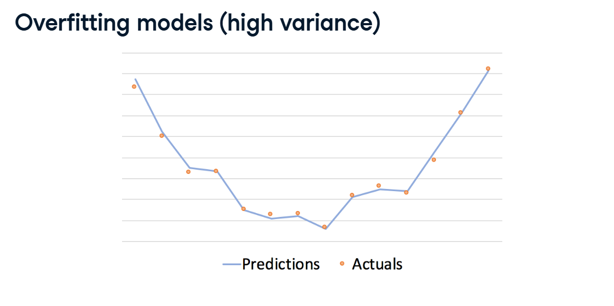
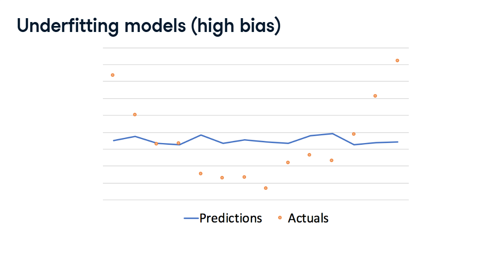
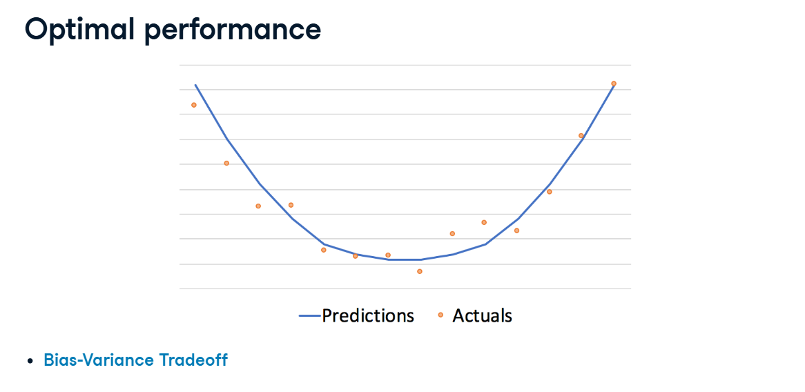

# The Bias-Variance Tradeoff

When evaluating models, our goal is to identify a model that is a "good fit." One way to do this is to consider **bias** and **variance**.

## 1. Variance (Overfitting)

**Variance** occurs when a model pays too close attention to the training data and fails to generalize to new, unseen testing data.
*   These models perform really well on the training data, but poorly on the testing data.
*   This is known as **Overfitting**.

Overfitting occurs when our model starts to attach meaning to the "noise" in the training data, essentially memorizing the dataset rather than learning the actual pattern.

*It is easy to identify overfitting because the training error will be a lot lower than the testing error.*

**Example of Overfitting:**
Notice how the testing accuracy (.83) is much lower than the training accuracy (1.0). The model has perfectly memorized the training data by making the trees too deep (`max_depth=14`).

## 2. Bias (Underfitting)

**Bias** occurs when the model fails to find the underlying relationships between the data and the response value.
*   These models lead to high errors on *both* the training and testing datasets.
*   This is known as **Underfitting**.

Underfitting happens when the model cannot capture the patterns in the data (e.g., if we don't have enough trees in our forest, or if our trees are not deep enough).

*Underfitting is more difficult to identify because both errors are high. It is hard to know if we got the most out of the data or if the model can still be improved.*

**Example of Underfitting:**
Notice how both the training and testing accuracy are relatively low (around .84 and .77). A max depth of 4 was not deep enough to capture the patterns in the data.

## 3. Optimal Performance

When our model is getting the most out of the training data, while still performing well on the testing data, we have **optimal performance**. The model has generalized well to the underlying pattern without memorizing the noise.

So, how do we know if we have a good fit, or if we are underfitting/overfitting? By experimenting with parameters!

**Example of an Optimal Fit:**
By testing different parameters, we found that a max depth of 10 brought the testing accuracy up to .86, while bringing it much closer to the training accuracy of .89.

This indicates that the model is generalizing well to new data while still performing really well overall. We improved our testing accuracy by almost 10% over the underfit model!
