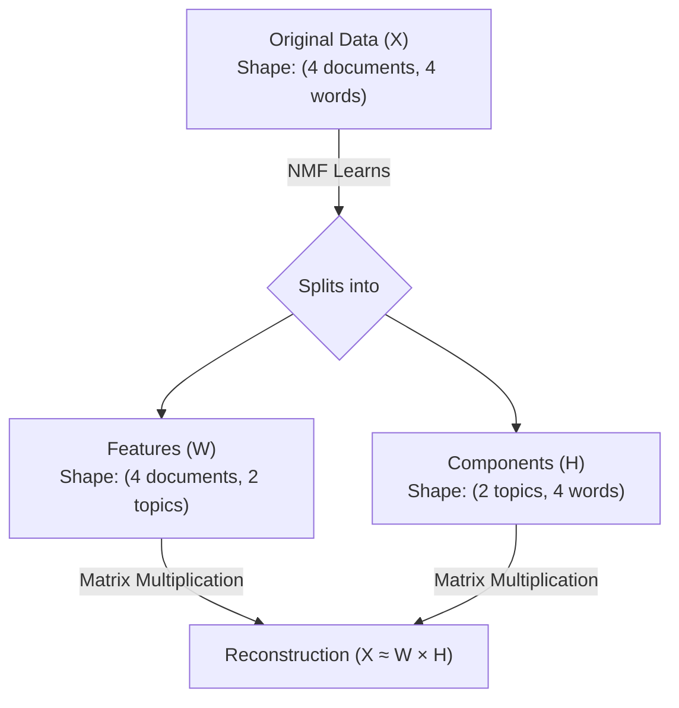

# Concept

## Non-negative Matrix Factorization (NMF)

NMF, like PCA, is a **dimension reduction technique**. 

However, in contrast to PCA, **NMF models are interpretable**. This means an NMF model is much easier to understand yourself and explain to others. NMF achieves its interpretability by decomposing samples into combinations of common themes (for documents) or common patterns (for images).

**The Catch:** NMF cannot be applied to every dataset. It requires that all sample features be strictly "non-negative" (greater than or equal to 0). This makes it perfect for word-frequency arrays, audio spectrograms, and e-commerce purchase histories.

---

## When should you use each?

### Use PCA when:
* Your main goal is pure dimensionality reduction (compression).
* Your data contains negative values or has been standardized/centered.
* Interpretability is less important than capturing the absolute maximum variance.

### Use NMF when:
* All features are strictly non-negative.
* You want human-interpretable components.
* You expect the data to be built from additive parts.

> **A Simple Analogy: Making Fruit Juice**
> * **PCA says:** *"I'll find the best mathematical directions to describe the flavor."* (Optimal mathematically, but involves weird additions/subtractions that aren't intuitive).
> * **NMF says:** *"This juice is 60% orange, 30% mango, and 10% pineapple."* (Understandable, additive parts).

---

## How NMF Works (Components and Features)

Just as PCA has principal components, NMF learns **components** from the samples. 
* **Components ($H$):** The shared hidden topics/patterns learned from the entire dataset.
* **Feature Values ($W$):** The weights that tell you how strongly each individual sample uses each component.

> **An Intuition That Often Makes it Click: A Band Playing Music**
> * **Components** are the instruments available in a band: 🎸 Guitar, 🥁 Drums, 🎹 Piano.
> * **Features** tell you how loudly each instrument plays in a particular song.
> The instruments (components) stay the same for every song, but the volumes (features) change from song to song.

### Why NMF is NOT Clustering
Components are hidden patterns, **not clusters**. 
* **Clustering (K-Means)** assigns a document to exactly one group (e.g., Programming OR Sports).
* **NMF** allows every document to be a *mixture* of multiple components (e.g., 50% Programming AND 50% Sports). 

---

## Example Usage of NMF in Python

NMF is available in `scikit-learn` and follows the exact same `fit`/`transform` pattern as PCA. However, unlike PCA, **the desired number of components must always be specified**. NMF works both with NumPy arrays and sparse arrays (`csr_matrix`).

*Note: When analyzing text, we often use `tf-idf` (Term Frequency-Inverse Document Frequency) arrays, which reduces the influence of frequent words like "the".*

```python
# Import NMF
from sklearn.decomposition import NMF

# Create an NMF model, specifying the number of components
model = NMF(n_components=2)

# Fit the model to the non-negative samples
model.fit(samples)

# Transform the samples into NMF features
nmf_features = model.transform(samples)
```

### Inspecting the Math
Once the model is fit, you can inspect the matrices it generated:

**1. The Components (The Hidden Topics):**
```python
print(model.components_)
# Output:
# [[ 0.01  0.    2.13  0.54]
#  [ 0.99  1.47  0.    0.5 ]]
```

**2. The Features (The Weights per Document):**
```python
print(nmf_features)
# Output:
# [[ 0.    0.2 ]
#  [ 0.19  0.  ]
#  ...
#  [ 0.15  0.12]]
```

---

## Step 5: Reconstruction (Matrix Factorization)

Now comes the coolest part: The features and the components of an NMF model can be multiplied and added together to reconstruct the original data samples! 

This calculation is known mathematically as the "product of matrices" (which is where the **Matrix Factorization** in NMF comes from).

Let's look at a single sample from the array and reconstruct it using the matrices we printed above:

```python
# The original data sample:
print(samples[i,:])
# [ 0.12  0.18  0.32  0.14]

# The NMF feature weights for this specific sample:
print(nmf_features[i,:])
# [ 0.15  0.12]
```

**The Reconstruction Math:**
Multiply each component by its corresponding feature weight and add them up:
```text
  0.15 * [ 0.01  0.    2.13  0.54 ]  (Component 1)
+ 0.12 * [ 0.99  1.47  0.    0.5  ]  (Component 2)
--------------------------------------------------
=        [ 0.1203  0.1764  0.3195  0.141 ]  (Reconstructed Sample)
```
*(Notice how incredibly close `[ 0.1203, 0.1764, ...]` is to the original `[ 0.12, 0.18, ...]`. With more components, the reconstruction becomes even more accurate!)*

### The Complete Picture (Matrix Factorization Visualized)

To truly master NMF, it helps to understand the shapes of the data before and after the algorithm runs. NMF is literally splitting one giant spreadsheet into two smaller spreadsheets that can be multiplied together to recreate the original.

Here is a visual map of how raw data ($X$) is factored into Features ($W$) and Components ($H$):



#### 1. The Original Data Matrix ($X$)
This is the raw data you feed into the model. In our toy example, it is a 4x4 matrix (4 documents, 4 words).

| Document | Python | AI | Football | Cricket |
| :--- | :--- | :--- | :--- | :--- |
| **Doc1** | 2 | 2 | 0 | 0 |
| **Doc2** | 0 | 0 | 2 | 1 |
| **Doc3** | 1 | 1 | 1 | 0 |
| **Doc4** | 1 | 2 | 0 | 0 |

#### 2. The Features Matrix ($W$)
When you set `n_components=2`, NMF learns the "weights" for each document. This matrix has the shape (4 documents, 2 topics).

| Document | Programming Weight | Sports Weight |
| :--- | :--- | :--- |
| **Doc1** | 2.4 | 0.0 |
| **Doc2** | 0.0 | 2.2 |
| **Doc3** | 1.0 | 0.8 |
| **Doc4** | 2.0 | 0.1 |

#### 3. The Components Matrix ($H$)
These are the shared hidden patterns learned from the whole dataset. This matrix has the shape (2 topics, 4 words).

| Topic | Python | AI | Football | Cricket |
| :--- | :--- | :--- | :--- | :--- |
| **Programming** | 0.9 | 0.8 | 0.1 | 0.0 |
| **Sports** | 0.0 | 0.1 | 0.8 | 0.9 |

#### The Magic of $X \approx W \times H$

If you want to reconstruct **Doc3**, you simply take its row from the Features matrix ($W$) and multiply it against the entire Components matrix ($H$):

> **Doc3 Reconstruction** = (1.0 × Programming Topic) + (0.8 × Sports Topic)
> = `1.0 * [0.9, 0.8, 0.1, 0.0]` + `0.8 * [0.0, 0.1, 0.8, 0.9]`
> = **`[0.9, 0.88, 0.74, 0.72]`**

This reconstructed row is extremely close to the original Doc3 row of `[1, 1, 1, 0]`. 

### Why is this Factorization so Powerful?
In this toy example, we split a 16-cell matrix ($X$) into an 8-cell matrix ($W$) and an 8-cell matrix ($H$). We didn't save any space. 

But imagine a real-world dataset with **1,000,000 documents** and **10,000 words**. 
* $X$ = 10 billion cells of data.
* If you run NMF with `100` components:
  * $W$ = 100 million cells.
  * $H$ = 1 million cells.

By factoring the matrix, you compressed 10 billion cells of data into just 101 million cells (a **99% reduction in memory!**). You keep the ability to approximate the original data, *and* you automatically discover human-readable topics along the way!
