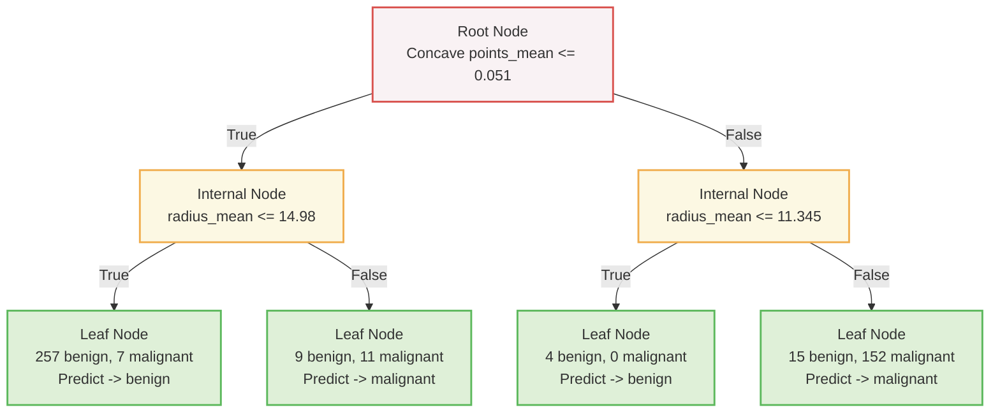

# Concept

## How Classification Trees Learn

We know that a Decision Tree plays a game of "20 Questions" to classify data. But how does it magically know which questions to ask, and when to stop asking them?

Here is the anatomy and the learning process of a Classification Tree.

---

### 1. The Anatomy of a Tree

A decision tree is built out of individual units called Nodes. There are three specific types of nodes:

* **The Root Node (The Top):** This is where the tree starts growing. It has zero parents above it. It asks the very first question (e.g., "Is tumor size < 1.5?") and splits the data into two branches down below.
* **Internal Nodes (The Middle):** These nodes are in the middle of the tree. They have a parent above them, and they ask follow-up questions to split the data into two more children below them.
* **Leaf Nodes (The Ends):** These are the dead-ends. A leaf node has no children below it and asks no questions. This is where the final prediction is made.

**How does a Leaf make a prediction?**
When a new patient's data trickles down the tree and lands in a specific Leaf, the tree looks at the historical data that ended up in that bucket. If the bucket has 257 benign tumors and 7 malignant tumors, the tree goes with the majority vote and predicts: "Benign."

Here is a visual example of a trained tree's anatomy predicting tumor classes based on cell radius and concave points:


*(Notice the maximum depth of this tree is 2)*

---

### 2. Information Gain (Choosing the Best Question)

How does a Root or Internal Node decide exactly which question to ask? It uses a concept called **Information Gain**.

The ultimate goal of the tree is to produce the "purest" leaves possible. A leaf is 100% pure if it contains only one class (e.g., 100 cats and 0 dogs). If a node is a 50/50 mix, it is highly impure.

* **Measuring Impurity:** The computer measures this messiness using mathematical criteria, most commonly the Gini-index or Entropy.
* **Maximizing Information Gain:** At every single step, the tree exhaustively tests every possible feature and every possible split-point (e.g., "Weight > 10", "Weight > 11", "Height > 5"). It calculates the purity of the parent node, and subtracts the purity of the proposed child nodes.
* **The Winner:** The exact question that results in the massive jump in purity (the highest Information Gain) is the question the tree locks in.

---

### 3. The Learning Process (Growing the Tree)

A classification tree grows recursively. This means it splits the Root, then looks at the new children and splits them, then looks at their children and splits them, repeating the exact same Information Gain math over and over.

**When does it stop growing?**

* **Unconstrained Trees:** If you don't give the tree any rules, it will keep growing and asking questions until the Information Gain is exactly zero (meaning every single leaf is 100% perfectly pure). **Warning:** This almost always leads to massive overfitting!
* **Constrained Trees:** You can force the tree to stop growing early by setting hyperparameters like `max_depth`. If you set `max_depth=2`, the tree will completely stop asking questions after 2 levels, forcing all nodes at that level to become Leaves, even if they aren't 100% pure yet.

---

### 4. Cheat Sheet: Python Code

In scikit-learn, you can explicitly tell the tree which math formula you want it to use to measure impurity (Gini-index vs. Entropy) by setting the `criterion` parameter.

```python
# Import necessary modules
from sklearn.tree import DecisionTreeClassifier
from sklearn.model_selection import train_test_split
from sklearn.metrics import accuracy_score

# Split dataset into 80% train, 20% test
X_train, X_test, y_train, y_test = train_test_split(X, y, test_size=0.2, stratify=y, random_state=1)

# Instantiate a Decision Tree model
# We constrain it (max_depth=2) to prevent overfitting
# We tell it to measure impurity using the Gini-index
dt = DecisionTreeClassifier(criterion='gini', max_depth=2, random_state=1)

# Fit it to the training data (This is when it recursively calculates Information Gain!)
dt.fit(X_train, y_train)

# Predict on the test set
y_pred = dt.predict(X_test)

# Evaluate test-set accuracy
accuracy = accuracy_score(y_test, y_pred)
print(accuracy) # e.g., 0.92105263157894735
```
