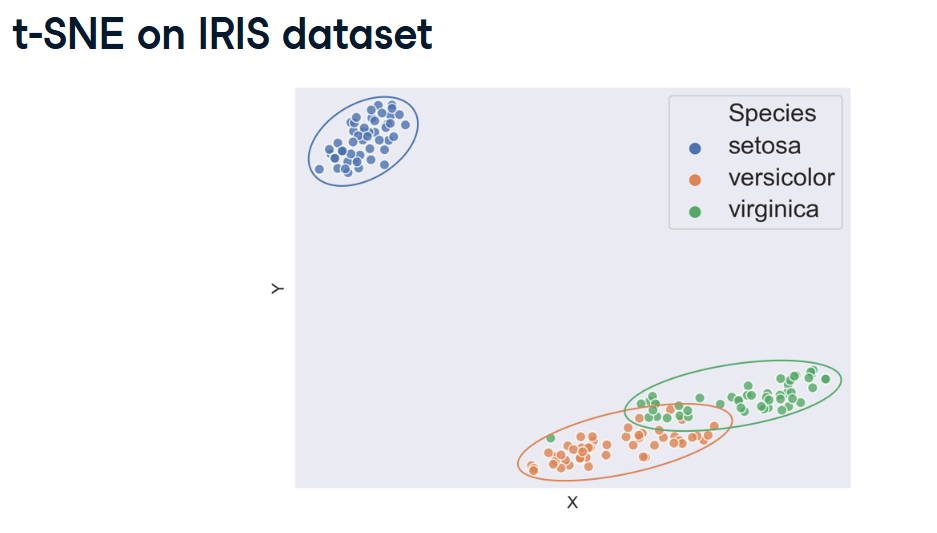
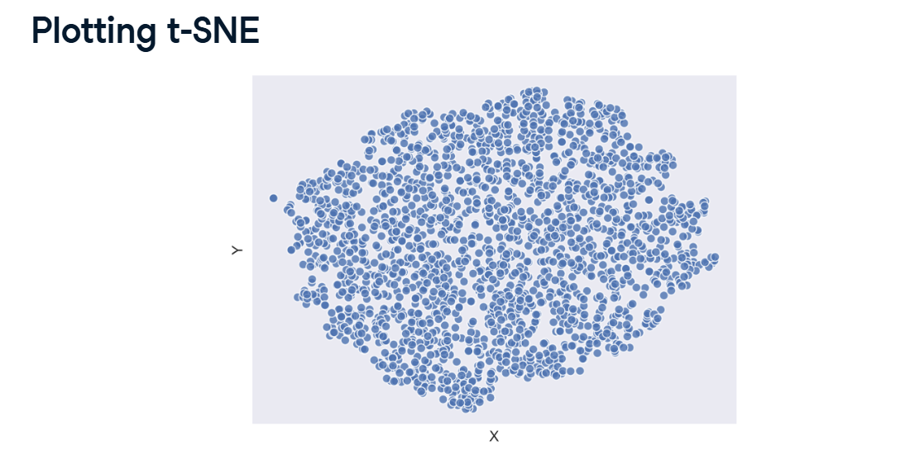
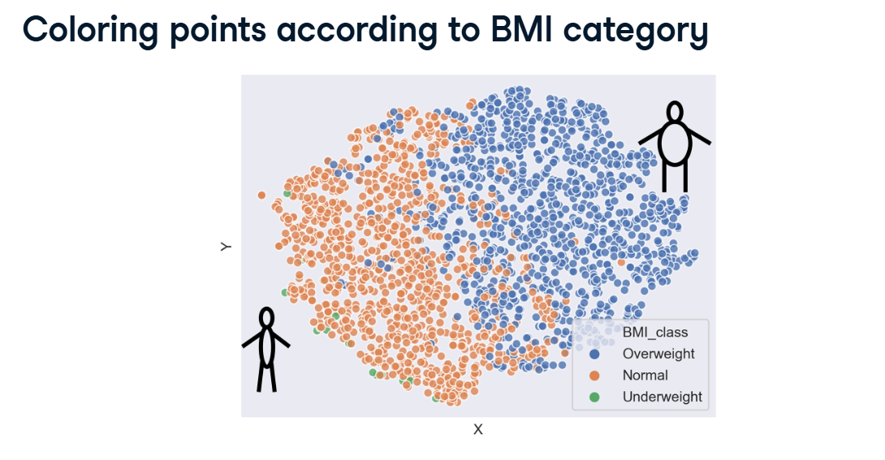
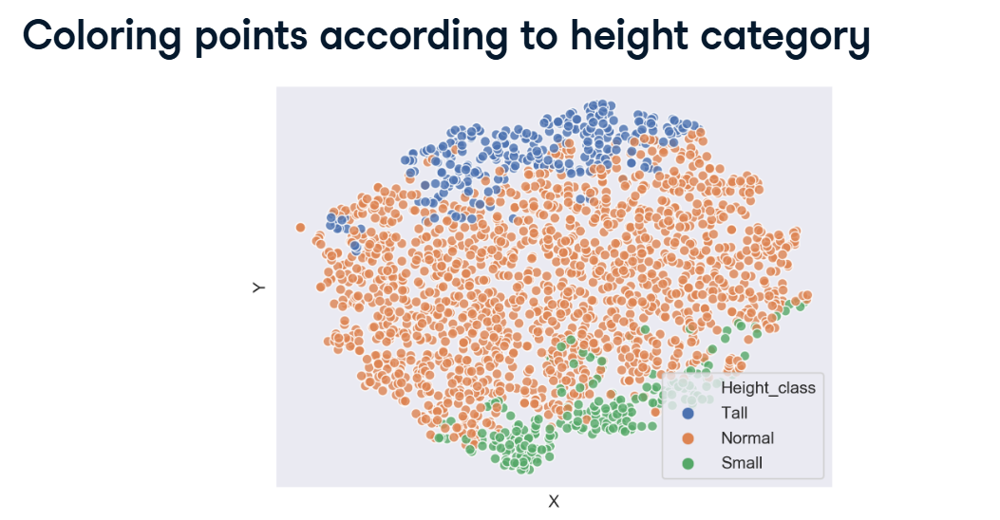
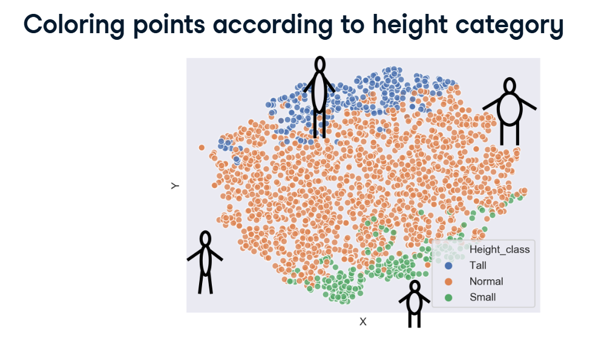

# Concept

## Visualizing Data with t-SNE

t-SNE (t-Distributed Stochastic Neighbor Embedding) sounds like a terrifying math term, but its goal is incredibly simple: It draws a 2D map of high-dimensional data.

If your dataset has 99 columns (like the female ANSUR body measurement dataset), human eyes cannot see it. We can't draw a 99-Dimensional graph. t-SNE acts like a magical shadow-caster. It mathematically squishes those 99 dimensions down onto a flat 2D piece of paper.

**The Golden Rule of t-SNE:** If two data points are highly similar in the massive 99D space, t-SNE ensures they are placed right next to each other on the flat 2D map.

---

### 1. Distinct Clusters vs. Continuous Blobs

When you run t-SNE, the shape of your 2D map tells you a lot about your data.

**Distinct Islands (The IRIS Dataset):** In the first image you shared, t-SNE clustered the IRIS flowers into three distinct, separate bubbles. This proves that the math easily found severe, distinct differences between the Setosa, Versicolor, and Virginica species.



**The Massive Blob (The ANSUR Dataset):** When t-SNE plotted the female body measurements, it just looked like one giant blue cloud of dots. Why? Because human bodies don't exist in three separate "species." Height and weight are on a continuous spectrum. There are no massive, unnatural gaps between human body types!



---

### 2. Preparing the Data (Numbers Only!)

Just like K-Means clustering, t-SNE is a math equation that calculates distance. It will immediately crash if you feed it text or categories.

Before you can run t-SNE, you must temporarily delete all categorical text columns (like `Gender`, `BMI_class`, or `Branch`) using Pandas' `.drop()` method.

---

### 3. The learning_rate Hyperparameter

When you build the t-SNE model in scikit-learn, you have to set a `learning_rate` (usually a number between 10 and 1,000).

Think of it as how "adventurous" the algorithm is when trying to find the perfect map.

*   A higher number means it takes wild, adventurous guesses to organize the dots.
*   A lower number makes it conservative. *(In your example, the instructor used 50).*

---

### 4. The Magic Trick: Bringing the Categories Back!

Wait, if we deleted the `BMI_class` and `Height_class` columns in Step 2, how are we supposed to know what the giant blue blob actually means?

**The Trick:** We let t-SNE do the math on the numbers. Once it hands us the final 2D coordinates (X and Y), we paste those coordinates back into our original, un-deleted dataframe! Then, we use Seaborn's `hue` tool to color-code the dots using the text categories!

**The BMI Reveal:** When we color the blob by `BMI_class`, we suddenly see a perfect gradient: Underweight people are on the far left, and Overweight people are on the far right. t-SNE mathematically figured out that weight was a massive driver of difference, and naturally organized the X-Axis around it!



**The Height Reveal:** When we color the blob by `Height_class`, the gradient shifts. Tall people are at the top, and short people are at the bottom. t-SNE naturally organized the Y-Axis around height!



Even though we never told the algorithm what BMI or Height were, it found those exact patterns hiding in the 99 columns of arm, leg, and torso measurements!

---

### 5. Cheat Sheet: The Complete t-SNE Code

Here is how you execute the entire pipeline shown in your screenshots, from dropping columns to plotting the final colorful map!



```python
import pandas as pd
import seaborn as sns
import matplotlib.pyplot as plt
from sklearn.manifold import TSNE

# 1. DROP NON-NUMERIC COLUMNS
# t-SNE only understands math!
non_numeric = ['BMI_class', 'Height_class', 'Gender', 'Component', 'Branch']
df_numeric = df.drop(non_numeric, axis=1)

# 2. INSTANTIATE AND FIT THE MODEL
# We set a learning rate of 50.
# fit_transform() outputs a numpy array with exactly 2 columns (X and Y coordinates)
m = TSNE(learning_rate=50)
tsne_features = m.fit_transform(df_numeric)

# 3. GLUE THE COORDINATES BACK TO THE ORIGINAL DATA
# We take the X and Y coordinates and attach them as new columns to the original 
# 'df' (which still has all our text categories like BMI_class!)
df['x'] = tsne_features[:, 0]
df['y'] = tsne_features[:, 1]

# 4. PLOT AND COLOR-CODE!
# We tell Seaborn to use our new 'x' and 'y' columns, but we color (hue) the dots
# using the 'BMI_class' text column we kept safe!
sns.scatterplot(x="x", y="y", hue='BMI_class', data=df)

plt.title("t-SNE: ANSUR Dataset colored by BMI")
plt.show()
```
