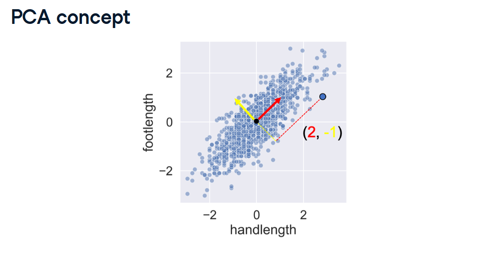
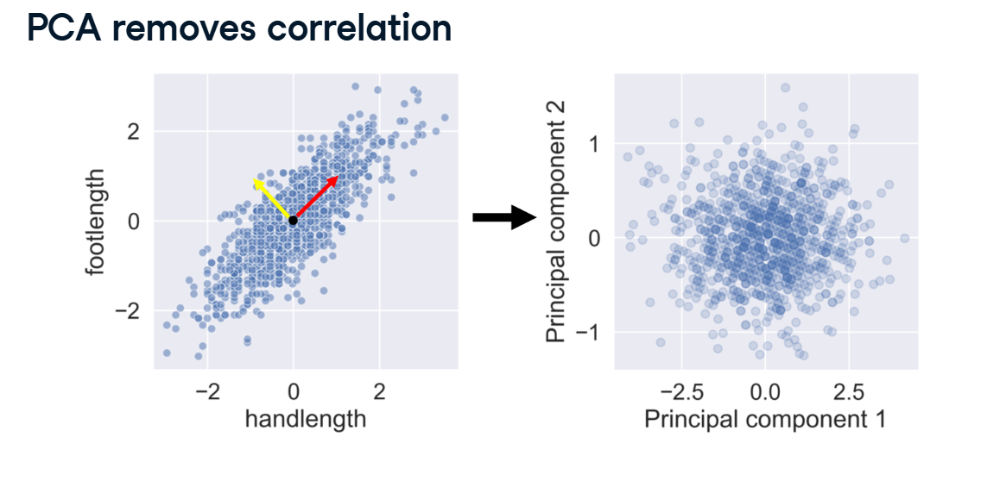
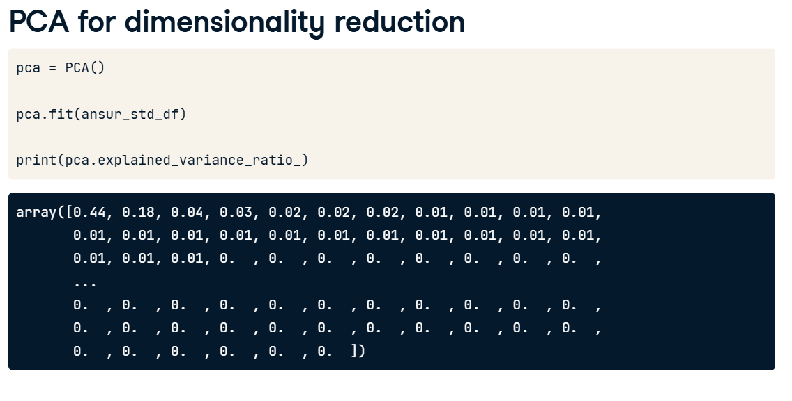

# Principal Component Analysis (PCA)

In the previous lesson, we learned that Feature Extraction combines columns together to save space. The most powerful algorithm for doing this is PCA (Principal Component Analysis).

Here is exactly how PCA performs this magic trick, step-by-step, using the visuals from your lesson!

## 1. The Core Concept (Drawing New Lines)

Look at your first image (PCA concept). You have a scatterplot comparing handlength and footlength. The dots form a tight, diagonal shape pointing up and to the right.



Instead of picking one feature and deleting the other, PCA draws a brand new coordinate system directly through the data:

*   **The Red Arrow (Principal Component 1):** PCA finds the absolute longest, most spread-out direction in the data cloud and draws an arrow straight through it. This red arrow captures the vast majority of the information (the overall "Size" of the person).
*   **The Yellow Arrow (Principal Component 2):** PCA draws a second arrow perfectly perpendicular (at a 90-degree angle) to the red one. This captures whatever tiny bits of variance the red arrow missed (e.g., people with slightly unusually large hands for their foot size).

Instead of using raw inches or millimeters, every point is now described by its coordinates on these new red and yellow arrows!

## 2. The Result: Killing Correlation

Look at your second image (PCA removes correlation).



*   **Before PCA (Left):** `footlength` and `handlength` are highly correlated. If you know one, you can easily guess the other.
*   **After PCA (Right):** The algorithm literally rotates the graph so that the Red Arrow and Yellow Arrow become the new X and Y axes.

Look at the new graph! It is just a massive, circular blob. PCA has completely destroyed the correlation. Because the new axes (Principal Component 1 and Principal Component 2) are mathematically guaranteed to be perfectly perpendicular, they share absolutely zero duplicate information.

## 3. The Magic Metric: Explained Variance Ratio

Because these new components share zero duplicate info, PCA ranks them from "Most Important" to "Least Important."

Look at your third image (PCA for dimensionality reduction). The dataset compares right leg mm and left leg mm. They are so perfectly correlated that the dots just look like a single straight line.


If you ask Python how much information each new arrow captured (using `pca.explained_variance_ratio_`), it outputs:
`[0.9997, 0.0003]`

*   **Component 1 (Red Arrow):** Captured 99.97% of the total variance in the data.
*   **Component 2 (Yellow Arrow):** Captured 0.03% of the variance.

**The Dimensionality Reduction:** Because Component 2 is basically capturing 0% of the useful information, you can throw it in the trash! You just compressed a 2-column dataset into a 1-column dataset while preserving 99.97% of the original information!

## 4. Scaling Up (The Cumulative Sum)

Visualizing 2 columns is easy. But what about the ANSUR dataset, which has 94 highly correlated body measurements?



If you run PCA on 94 columns, it will spit out 94 Principal Components. To figure out how many of those 94 you can safely throw in the trash, data scientists use NumPy's Cumulative Sum (`np.cumsum`).

It adds the percentages up one by one. You might look at the output and say: *"Wow, the first 10 components add up to 80% of the total variance. I'm going to keep those 10 and delete the other 84!"*

## 5. Cheat Sheet: Python Code

Here is how you actually run this math in Scikit-Learn!

> [!WARNING]  
> **Crucial Warning:** PCA measures variance (how spread out the data is). If you do not scale your data first, columns with naturally large numbers (like Salary) will completely hijack the PCA arrows. You MUST use `StandardScaler` before running PCA!

```python
import pandas as pd
import numpy as np
from sklearn.preprocessing import StandardScaler
from sklearn.decomposition import PCA

# 1. SCALE THE DATA (Mandatory for PCA!)
scaler = StandardScaler()
X_scaled = scaler.fit_transform(X)

# 2. INSTANTIATE AND FIT PCA
# (We don't restrict the components yet, we just let it calculate all of them)
pca = PCA()
pca.fit(X_scaled)

# 3. CHECK THE EXPLAINED VARIANCE
# This tells us the percentage of info captured by each component
print("Variance per component:", pca.explained_variance_ratio_)

# 4. CALCULATE THE CUMULATIVE SUM
# This adds the percentages together step-by-step so we know when to stop!
# E.g., [0.44, 0.62, 0.75, 0.81...]
cumulative_variance = np.cumsum(pca.explained_variance_ratio_)
print("Cumulative Variance:", cumulative_variance)

# 5. TRANSFORM THE DATA
# Once you decide how many components you need (e.g., 2), you can re-run it!
pca_final = PCA(n_components=2)
X_compressed = pca_final.fit_transform(X_scaled)

# X_compressed is now your brand new, dimensionally-reduced dataset!
```
