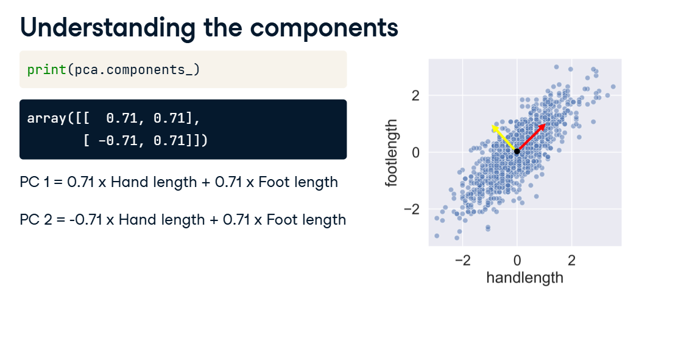
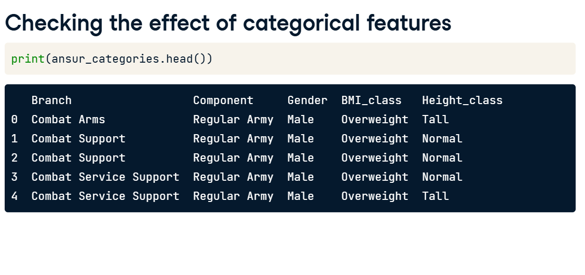
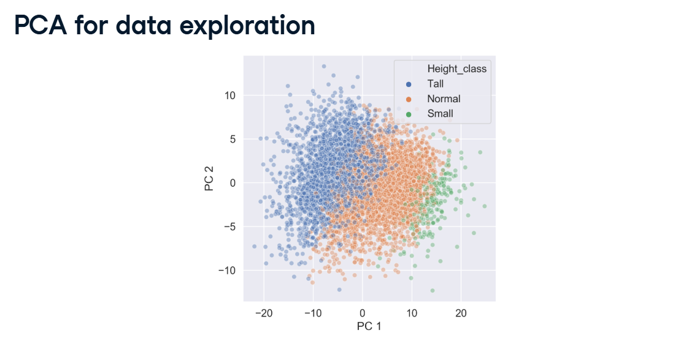
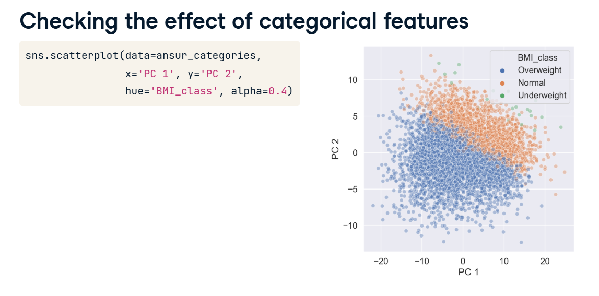

# PCA Applications & Pipelines

When you use PCA to compress a dataset, you sacrifice a little bit of variance to reduce the number of columns.

However, the biggest downside of PCA is that the new columns it hands back to you are just named "Principal Component 1" and "Principal Component 2". To a human, these names mean absolutely nothing.

Here is how you figure out what those components actually mean, and how you use them to build a highly accurate machine learning pipeline.

---

## 1. Decoding the Components (The "Recipe")

To understand what a Principal Component represents, we have to look at its recipe. You can see this recipe using the `pca.components_` attribute in Scikit-Learn.

Look at the handlength vs footlength example from the lesson:
When you print the components, it outputs an array of weights (coefficients).



**PC 1 = (0.71 $\times$ Hand) + (0.71 $\times$ Foot)**

**What it means:** Both features have a strong, positive effect on this component. If a person has big hands and big feet, their PC 1 score goes way up. We can logically rename PC 1 in our heads to "Overall Size".

**PC 2 = (-0.71 $\times$ Hand) + (0.71 $\times$ Foot)**

**What it means:** Hand length has a negative effect, but foot length has a positive effect. A person who scores high on PC 2 must have unusually large feet compared to their hands. We can rename PC 2 to "Foot-to-Hand Ratio".

By looking at which original features have the biggest positive or negative effects, you can give real-world meaning to these abstract math vectors!

---

## 2. Data Exploration (The Categorical Coloring Trick)

PCA is strictly a mathematical algorithm; it will crash if you feed it categorical text like "Gender" or "BMI Class".



However, you can use those text categories **after** the PCA math is done to verify your components! We do this by plotting Principal Component 1 (X-axis) against Principal Component 2 (Y-axis) and using Seaborn's `hue` to color the dots.

### The Height Check
If you color the dots by "Height Class" (Tall, Normal, Short), you will see a perfect color gradient stretching horizontally across the X-axis. This visually proves that the 1st Principal Component is primarily driven by a person's Height!



### The BMI Check
If you color the dots by "BMI Class" (Underweight, Normal, Overweight), you will see the color gradient stretching diagonally/vertically. This proves your 2nd Principal Component is measuring weight and BMI.



Even though PCA was completely blind to these categories, it naturally discovered them in the raw numeric measurements!

---

## 3. The Ultimate PCA Pipeline

Once you are done exploring, you can use PCA to build an incredibly fast, highly accurate predictive model.

Because PCA strictly requires your data to be scaled first, you should always combine the steps using a Scikit-Learn Pipeline.

### Cheat Sheet: Python Code

Here is how you chain a Scaler, a PCA Reducer, and a Random Forest Classifier into a single automated assembly line.

```python
import pandas as pd
from sklearn.preprocessing import StandardScaler
from sklearn.decomposition import PCA
from sklearn.ensemble import RandomForestClassifier
from sklearn.pipeline import Pipeline
from sklearn.model_selection import train_test_split
from sklearn.metrics import accuracy_score

# 1. SPLIT THE DATA
X_train, X_test, y_train, y_test = train_test_split(X, y, test_size=0.3, random_state=42)

# 2. BUILD THE PIPELINE
# We chain the Scaler, the PCA Reducer (keeping only 3 components), and the Model.
pipe = Pipeline([
    ('scaler', StandardScaler()),
    ('reducer', PCA(n_components=3)),
    ('classifier', RandomForestClassifier())
])

# 3. FIT THE PIPELINE
# The data is automatically scaled, compressed into 3 columns, and fed to the Random Forest!
pipe.fit(X_train, y_train)

# 4. INSPECT THE PCA MATH
# We can extract the specific PCA step from the pipeline dictionary to see its secrets:
pca_step = pipe.named_steps['reducer']
print("Variance captured by the 3 components:", pca_step.explained_variance_ratio_)
print("Total Variance Kept:", sum(pca_step.explained_variance_ratio_))
# Output: ~0.74 (We only kept 74% of the original information!)

# 5. TEST THE MODEL
y_pred = pipe.predict(X_test)
print("Accuracy:", accuracy_score(y_test, y_pred))
# Output: 0.986 (98.6% Accuracy!)
```

### The Mind-Blowing Conclusion

In the example above, the PCA algorithm deleted almost 26% of the variance in the dataset by compressing 94 features down to just 3 components.

However, the Random Forest model still scored an impressive **98.6% accuracy** on the test set! 

Why? Because that 26% of variance we threw away was mostly useless, redundant noise. By using PCA, we made the model simpler, faster, and highly accurate!
