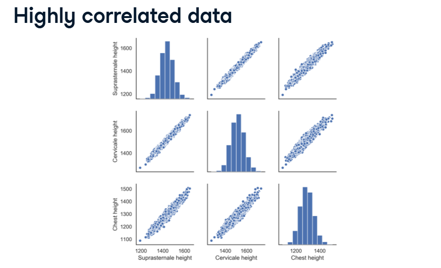
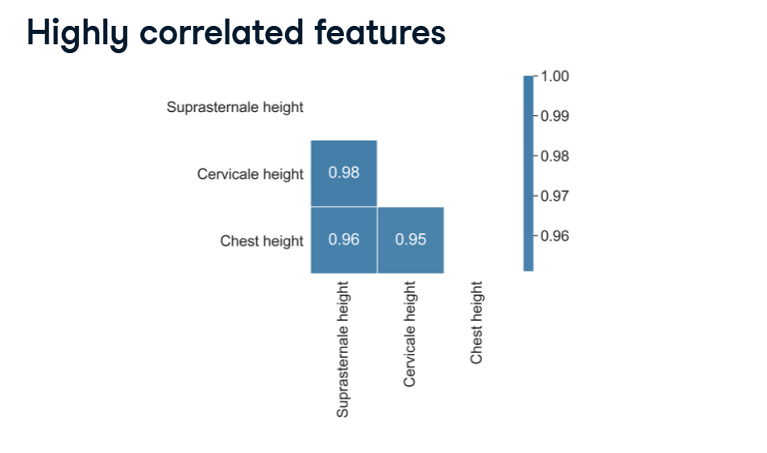
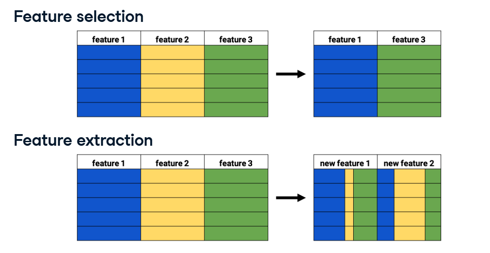
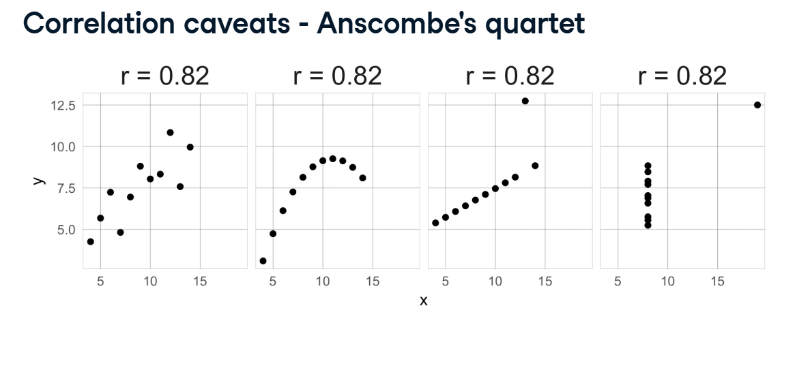
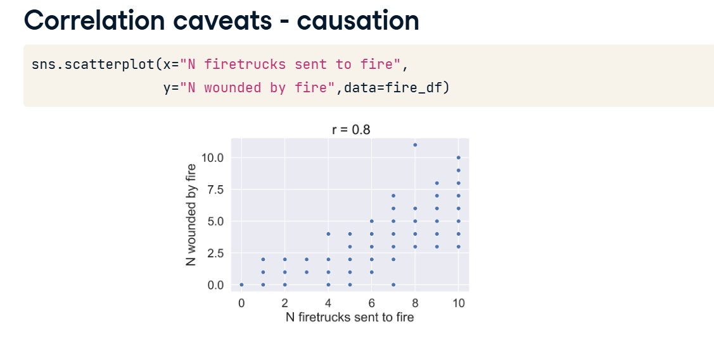

# Concept

## Dealing with Correlated Features & Caveats

In our last lesson, we learned how to find correlated features using a heatmap. Now, what do we actually do with them? And more importantly, what are the dangerous traps we need to watch out for when looking at correlation scores?

Here is the breakdown based on the visual examples from your lesson.

---

### 1. Removing Highly Correlated Features

If two features are perfectly correlated ($r = 1.0$), they are giving the model the exact same information twice. But what if they are almost perfectly correlated?

**The Bone Measurement Example:**
Look at the pairplot and heatmap from your images (Suprasternale height, Cervicale height, and Chest height).

In the pairplot, the dots form incredibly tight, diagonal lines.

In the heatmap, their correlation scores are `0.98`, `0.96`, and `0.95`.

These are three different bones located right next to each other in the human chest. Because they grow together, if you know the size of one, you basically know the size of all three.

**The Fix:** Keeping all three adds useless complexity to your model and risks overfitting (the model might start trying to find fake patterns in the tiny 2% difference between the bones). 
You should use a correlation matrix mask to filter out these high scores, and drop two of the three columns, keeping only one representative measurement!

---

### 2. Feature Selection vs. Feature Extraction

If you are afraid to completely throw away a highly correlated column because you think it might contain a tiny bit of unique information, you have an alternative.

*   **Feature Selection (Top Image):** This is the brute-force approach. You look at Feature 2 (Yellow) and Feature 3 (Green), realize they are highly correlated, and literally throw Feature 2 in the trash. You lose whatever tiny bit of unique info was in the yellow block.
*   **Feature Extraction (Bottom Image):** You use an algorithm (like PCA) to mathematically squish the Yellow and Green features together. It creates brand new, compressed columns that contain the "essence" of both original features!

---

### 3. The Math Trap: Anscombe's Quartet

Here is the biggest caveat in data science: **Never trust a correlation coefficient ($r$) without actually looking at the graph.**

Look at the image of the four distinct scatterplots (known as Anscombe's Quartet).

If you just ran the `.corr()` math in Python, the computer would tell you that every single one of these datasets has the exact same correlation score: $r = 0.82$. 

But human eyes can see they are completely different!
*   **Top Left:** A normal, messy, upward-trending dataset.
*   **Top Right:** A perfect curve. *(Linear correlation completely fails to capture curves!)*
*   **Bottom Left:** A perfect straight line, but one massive outlier pulls the $r$ score down.
*   **Bottom Right:** A perfectly vertical stack of data (no correlation), but one crazy outlier forces the math to calculate a strong 0.82 correlation!

**The Lesson:** A single outlier can completely break your math. Always plot your data!

---

### 4. The Logic Trap: Correlation $\neq$ Causation

Look at the final scatterplot in your images: "N firetrucks sent to fire" vs. "N wounded by fire".

The math shows a very strong positive correlation ($r = 0.8$). As the number of firetrucks goes up, the number of wounded people goes up.

If a machine learning model looks blindly at this data, it might conclude: *"Firetrucks are dangerous! Sending firetrucks causes people to get hurt! To save lives, we should stop sending firetrucks to fires!"*

**The Lesson:** The model is missing a **Lurking Variable** (the size of the fire). A massive, raging fire causes a lot of injuries, AND it requires a lot of firetrucks. They are correlated, but one does not cause the other. You must always use human business logic to sanity-check your model's discoveries!
