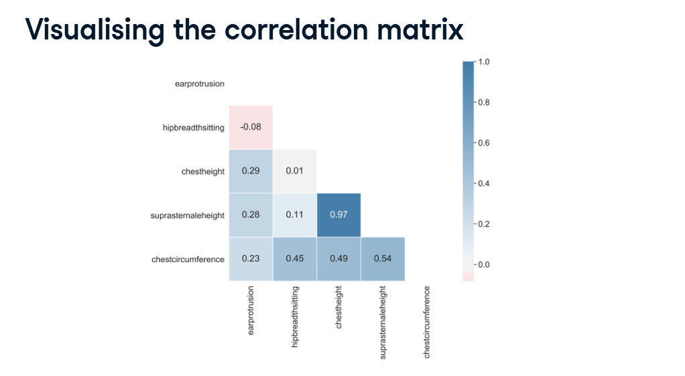
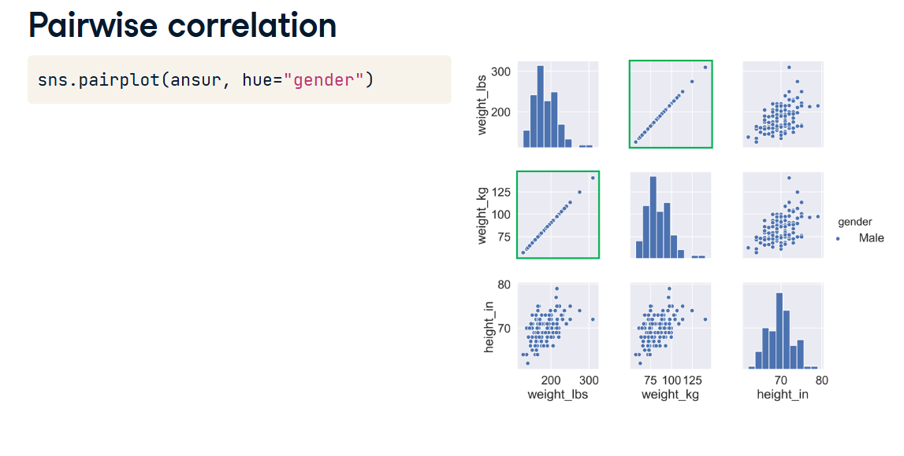
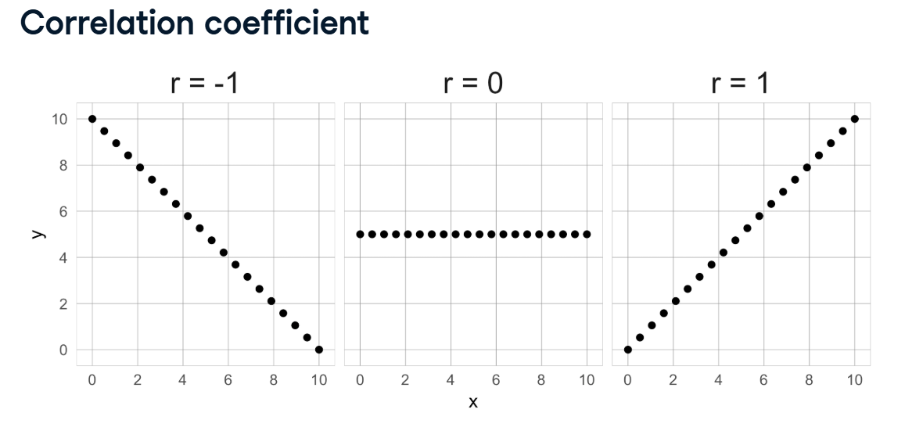
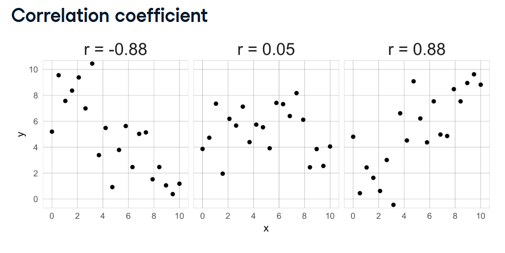
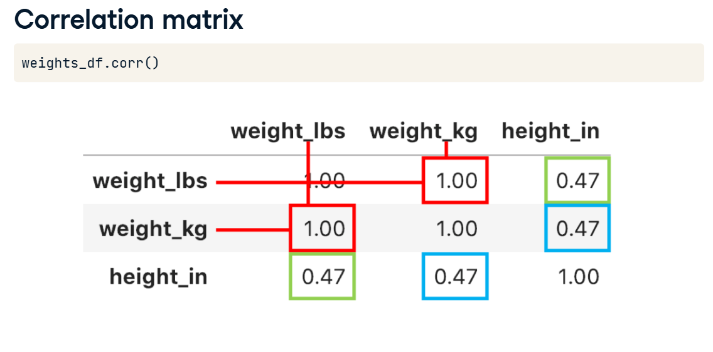
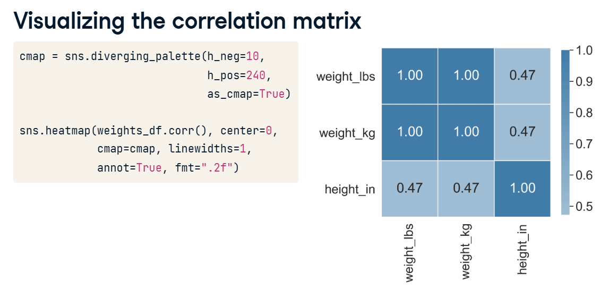
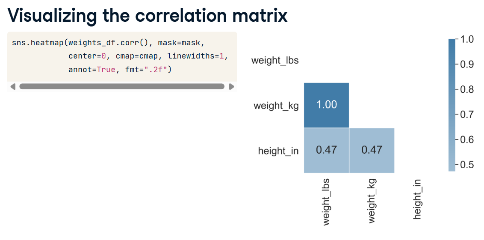

# Concept

## Pairwise Correlation

In the previous lesson, we deleted columns that were "boring" (low variance) or "blank" (missing data).
Now, we have to look for columns that are **Redundant**.

If you have a dataset with a column for `weight_lbs` and another column for `weight_kg`, they are telling the computer the exact same piece of information twice. We need to find these duplicate columns and delete one of them!

---

### 1. The Math: Correlation Coefficient ($r$)

We can use a pairplot to visually spot these duplicates (they form a perfectly straight diagonal line). But for large datasets, we need a mathematical score to quantify exactly how connected two columns are.

We use the **Correlation Coefficient ($r$)**.

The $r$ score always sits on a scale between `-1.0` and `+1.0`.


**$r = 1$ (Perfect Positive):** As Feature A goes up, Feature B goes up in perfect lockstep. They form a perfect straight line going up.


**$r = -1$ (Perfect Negative):** As Feature A goes up, Feature B goes exactly down. They form a perfect straight line going down.


**$r = 0$ (No Correlation):** The two features have absolutely nothing to do with each other. The dots look completely random.

> [!WARNING]
> **The Real-World Caveat:**
> In the real world, data is messy. You rarely get a perfect $1$ or $-1$.
> 
> 
> 
> You are more likely to see a score like $r = 0.88$. The dots are a bit scattered and messy, but they still clearly trend upwards together!

---

### 2. The Correlation Matrix

To calculate the $r$ score for every single column compared to every other column, we use the Pandas `.corr()` method. It generates a massive grid of numbers called a **Correlation Matrix**.



There are two quirks to reading this matrix:

1.  **The Diagonal of 1s:** If you compare `weight_lbs` to `weight_lbs`, it is a 100% perfect match. Because of this, the diagonal line straight down the middle of the grid is always filled with `1.0`s.
2.  **The Mirror Effect:** The top-right half of the grid is an exact mirror image of the bottom-left half. (The correlation between A and B is exactly the same as B and A).

---

### 3. Visualizing with a Heatmap

Looking at a massive grid of decimals hurts your eyes. So, Data Scientists use Seaborn to turn that grid into a Heatmap. It automatically colors the cells: dark colors for strong correlations, and light colors for weak correlations.



#### The Masking Trick (Cleaning up the Heatmap)
Because the top-right half of the matrix is just a useless mirror image, and the diagonal line is just a bunch of useless 1s, Data Scientists use a clever trick to hide them.

We use NumPy to create a "Mask" (specifically `np.triu()`, which stands for Triangle Upper). We lay this mask over the heatmap to completely block out the top-right triangle, leaving us with a clean, easy-to-read chart!



---

### 4. Cheat Sheet: Python Code

Here is how you generate the correlation matrix and plot a clean, masked heatmap in Python!

```python
import pandas as pd
import numpy as np
import seaborn as sns
import matplotlib.pyplot as plt

# 1. Calculate the Correlation Matrix using Pandas
# This does all the heavy math and generates the r scores!
corr_matrix = df.corr()

# 2. Create the Mask (The "Triangle Upper" trick)
# np.ones_like creates a grid of 'True' values the exact same size as our matrix.
# np.triu takes that grid and turns the bottom-left half into 'False'.
mask = np.triu(np.ones_like(corr_matrix, dtype=bool))

# 3. Plot the Heatmap!
plt.figure(figsize=(10, 8))

# We pass our corr_matrix, and we also pass the 'mask' we just built!
# (cmap is just a color palette, 'coolwarm' looks nice for this)
sns.heatmap(corr_matrix, mask=mask, cmap='coolwarm', annot=True, fmt=".2f")

plt.title("Feature Correlation Heatmap")
plt.show()
```

> [!TIP]
> **How to use the result:**
> Once the heatmap pops up, look for any cells that have a score extremely close to `1.0` or `-1.0` (like `0.98`). If two columns are that highly correlated, you should drop one of them from your dataset to reduce dimensionality!
