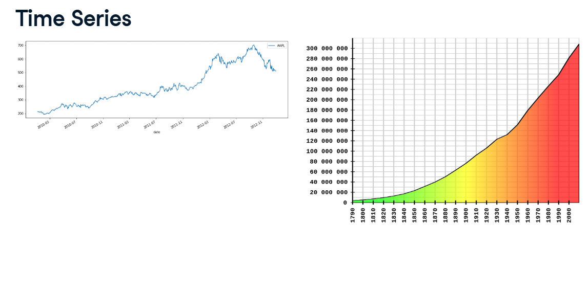
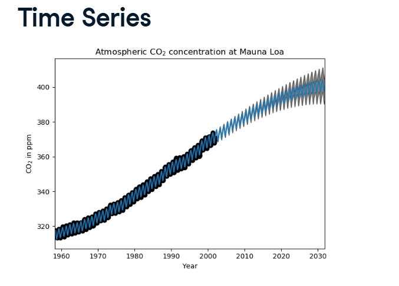
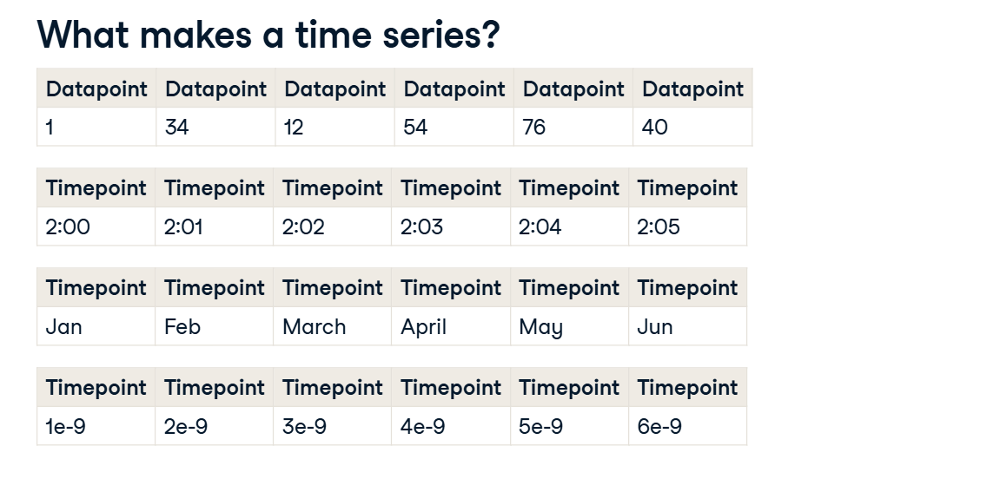
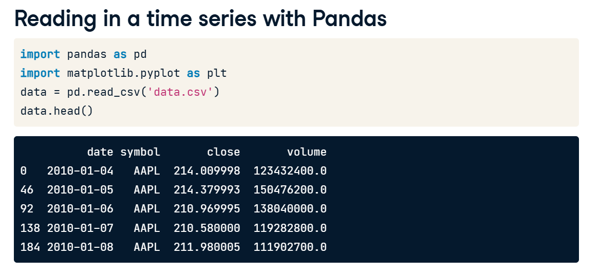
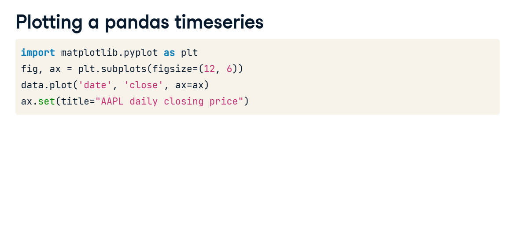
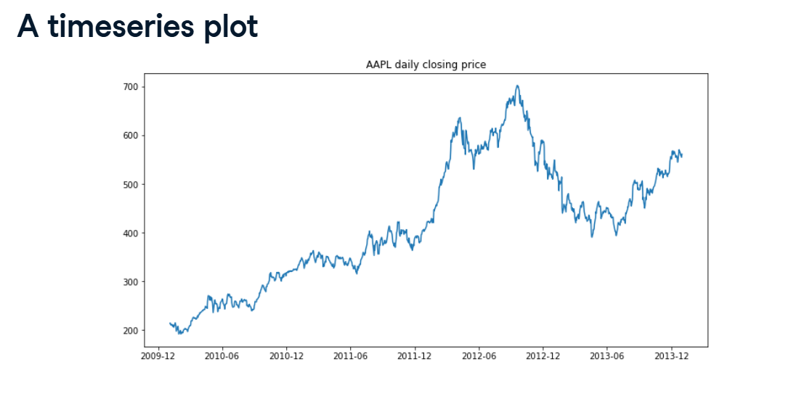
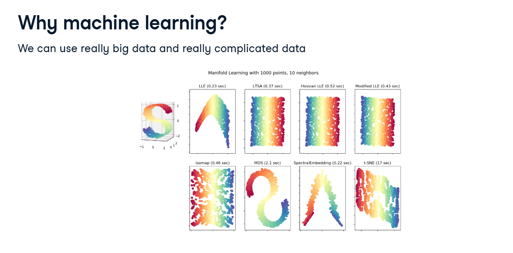
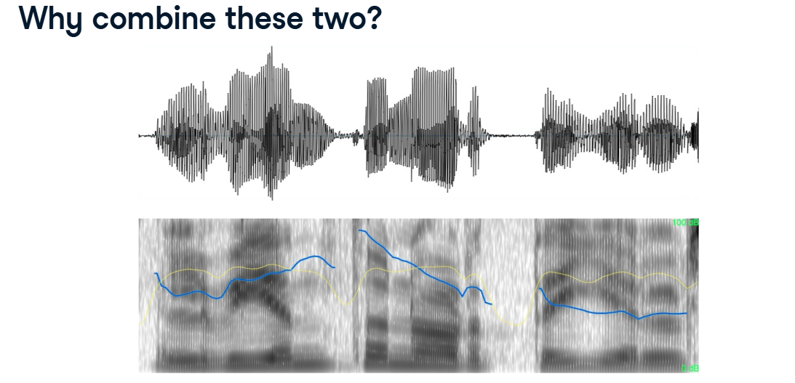
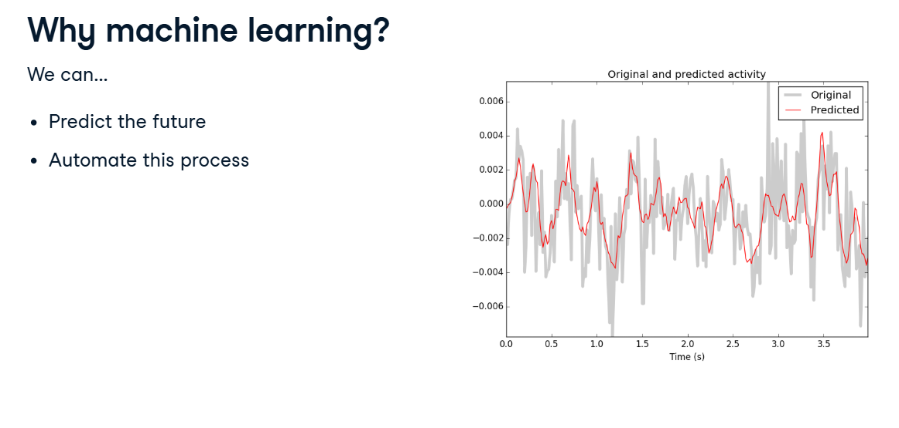

# Intro to Time Series & Machine Learning

Up until now, the datasets we have looked at have been "snapshots" in time. If we had a dataset of houses, it didn't matter what order the rows were in.

Time Series Data is different. It is not a snapshot; it is a movie. Order matters completely because the data changes over time.

## 1. What makes a Time Series?

Look at your third screenshot (What makes a time series?).



A Time Series is incredibly simple. It requires exactly two things:

*   **Datapoint:** The actual number you are measuring (e.g., 34, 12, 54).
*   **Timepoint:** The exact timestamp when that measurement was taken.

Timestamps can be almost anything! They can be times on a clock (2:00, 2:01), Months (Jan, Feb), dates (2010-01-04), or even fractions of a nanosecond (1e-9). 
The distance between these timestamps (e.g., exactly 1 day between measurements) is called the **Period**.

**Real World Examples:** The rising CO2 levels in the atmosphere, the daily closing price of Apple stock (AAPL), or the sound waves of your voice when you speak!



## 2. Handling Time Series in Python

Look at your screenshot showing Pandas and Matplotlib. Pandas is perfectly designed to handle time series data!



When you load a CSV file using `pd.read_csv()`, you can instantly plot it to visually spot the trends over time.



```python
import pandas as pd
import matplotlib.pyplot as plt

# 1. Load the data
data = pd.read_csv('data.csv')

# 2. Setup the blank canvas (12 units wide, 6 units tall)
fig, ax = plt.subplots(figsize=(12, 6))

# 3. Tell Pandas to plot the 'date' on the X-axis, and the 'close' price on the Y-axis!
data.plot('date', 'close', ax=ax)
ax.set(title="AAPL daily closing price")
plt.show()
```

**The Result:** As seen in your A timeseries plot screenshot, this instantly draws a beautiful line graph tracking the stock's rise and fall over the years.



## 3. Why use Machine Learning?

If we can just draw a line graph, why do we need Machine Learning?

**Massive, Complex Data:** Look at the screenshot with the colorful S shapes (Why machine learning?). Human eyes can look at a 2D line graph of a stock. But human eyes cannot process millions of data points interacting in 3D, 4D, or 100-Dimensional space. ML algorithms can easily find the hidden patterns in that massive complexity.



**Predicting the Future:** Once the algorithm learns the complex pattern of the past, we can automate it to predict what the line graph will do tomorrow!



## 4. Why combine ML and Time Series? (The Voice Example)

Look at your final screenshot (Why combine these two?).



The top image shows a raw audio waveform of someone speaking. It just looks like a chaotic, scribbly black line. If you feed that raw scribble into a standard ML model, it will likely fail to understand anything.

**The Time Series ML Pipeline:**



To fix this, Time Series Machine Learning follows a special 3-step pipeline:

1.  **Feature Extraction:** Because the data changes over time, we can extract special time-based signals. Look at the bottom half of the audio screenshot. By doing some math on the sound waves over time, we extract a rich, colorful "Spectrogram" with distinct frequency lines (the blue and yellow tracks). The computer can easily read these tracks to understand human speech!
2.  **Model Fitting:** We choose models specifically designed to handle sequential, ordered data.
3.  **Validation:** Evaluating a time series model is tricky. You cannot use a normal `train_test_split` because if you randomly shuffle the rows, you destroy the flow of time! We have to use special validation techniques to ensure we don't accidentally let the model peek into the future.
