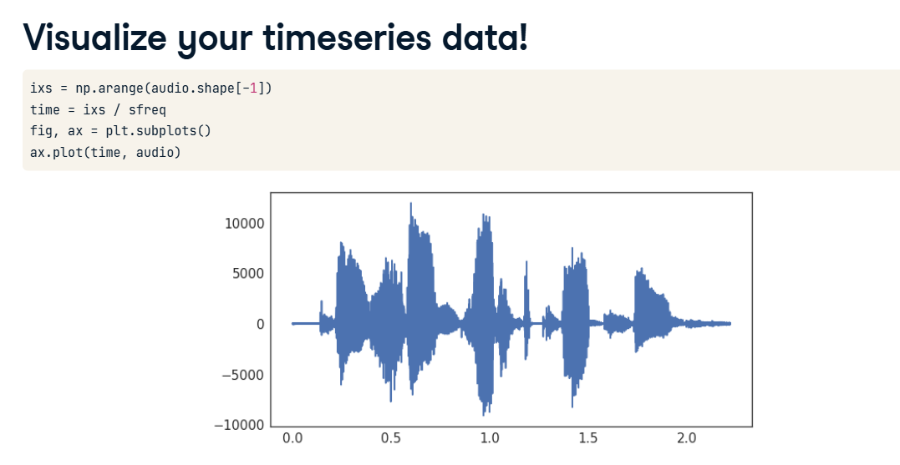
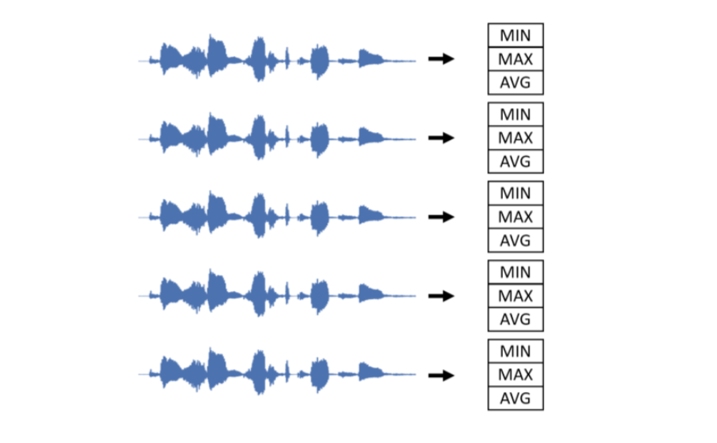

# Audio Classification & Feature Extraction

In the last lesson, we learned how to load raw time series data (like an audio waveform). But how do we actually teach a machine learning model to classify it? (e.g., Is this heartbeat healthy or abnormal?)

We cannot feed a raw audio wave directly into a standard classifier like `LinearSVC`. We have to extract features first!

## 1. The Problem: Raw Audio is Too Messy

*(See your Visualize your timeseries data! screenshot)*


That squiggly blue line is a raw audio waveform. To a computer, it is just an array of thousands of numbers (amplitudes) rapidly bouncing up and down.

If you feed that raw bouncing array into a classifier, it will be completely overwhelmed by the "noise" and fail to find any meaningful pattern. We need to simplify it!

## 2. The Solution: Summary Statistics (Feature Extraction)



Instead of asking the model to look at every single tiny vibration in the waveform, we calculate Summary Statistics for the entire audio clip.

For each audio file, we calculate three simple numbers:

*   **MIN:** The lowest (quietest) point in the audio.
*   **MAX:** The highest (loudest) point in the audio.
*   **AVG (Mean):** The average volume across the whole clip.

By doing this, we take an audio file that was originally 7,000 data points long, and we crush it down into just 3 meaningful numbers! This removes the complex "time" dimension and turns the data into a standard, clean format that models like `LinearSVC` love.

## 3. Calculating Features in Python

*(See your Calculating multiple features screenshot)*
Here is how we do that math instantly for all of our audio files at once!

```python
import numpy as np

# 'audio' is a 2D array: 20 audio files, each containing 7000 data points (20, 7000)

# We use np.mean, np.max, and np.std to calculate our features.
# CRITICAL: We must set `axis=-1`. 
# This tells numpy to calculate the average ACROSS the 7000 time points for each file,
# rather than calculating the average down the 20 files!

means = np.mean(audio, axis=-1)
maxs = np.max(audio, axis=-1)
stds = np.std(audio, axis=-1)

# Now, 'means' is just a 1D array of 20 numbers!
```

## 4. Prepping for Scikit-Learn

*(See your Preparing your features for scikit-learn screenshot)*
Right now, we have three separate 1D lists (`means`, `maxs`, `stds`).
Scikit-learn requires all of our features to be neatly packed into a single 2D grid (`samples`, `features`).

We use a special NumPy tool called `column_stack` to glue these three separate lists together side-by-side!

```python
from sklearn.svm import LinearSVC

# 1. Glue our 3 features together into a clean 2D grid (our X variable)
X = np.column_stack([means, maxs, stds])

# 2. Reshape our answers (y) just in case!
y = labels.reshape(-1, 1)

# 3. Fit the classifier!
model = LinearSVC()
model.fit(X, y)
```

## 5. Scoring the Model

*(See your final screenshot - Scoring your scikit-learn model)*
Once the model is trained on our new summary statistics, we test it on unseen audio files to see if it can successfully diagnose the heartbeats!

There are two ways to grade the test:

**Method A: The Manual Math Way**
```python
# Check if predictions exactly equal the test labels, add up the True answers, 
# and divide by the total number of labels to get a percentage!
percent_score = sum(predictions == labels_test) / len(labels_test)
```

**Method B: The Scikit-Learn Way (Much easier!)**
```python
from sklearn.metrics import accuracy_score

# Scikit-learn has a built-in function to do the exact same math!
percent_score = accuracy_score(labels_test, predictions)
```
