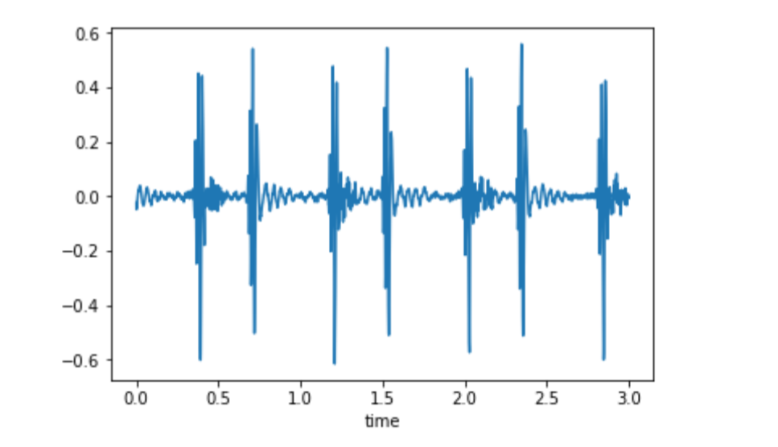
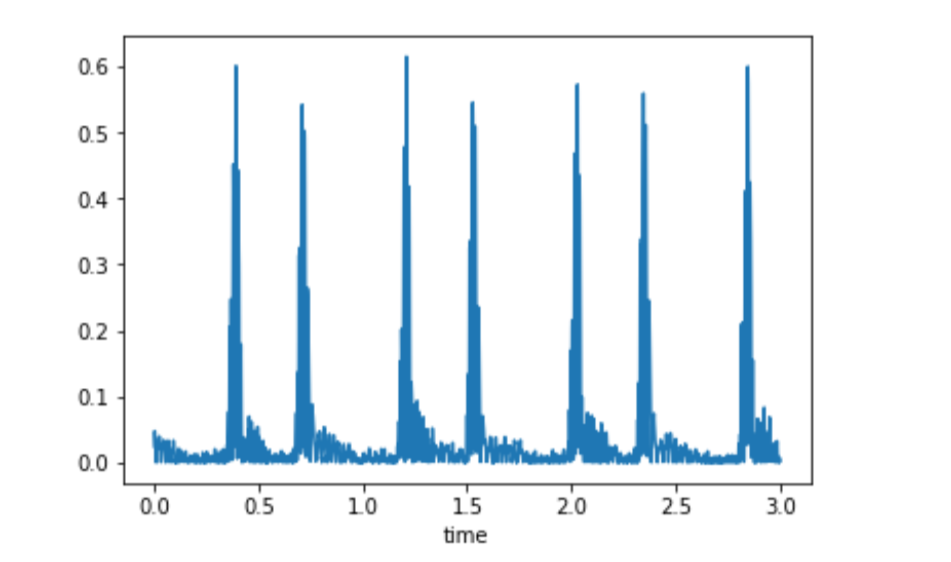
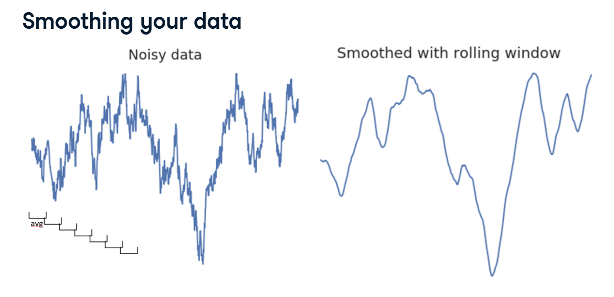
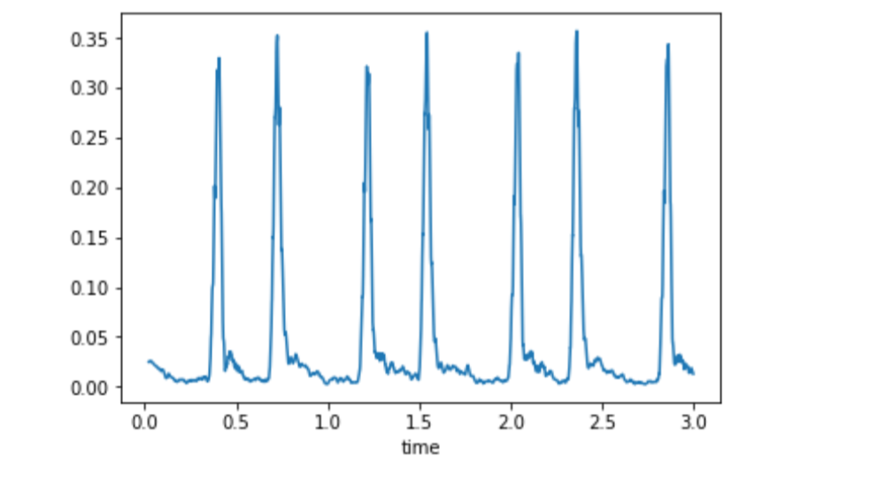
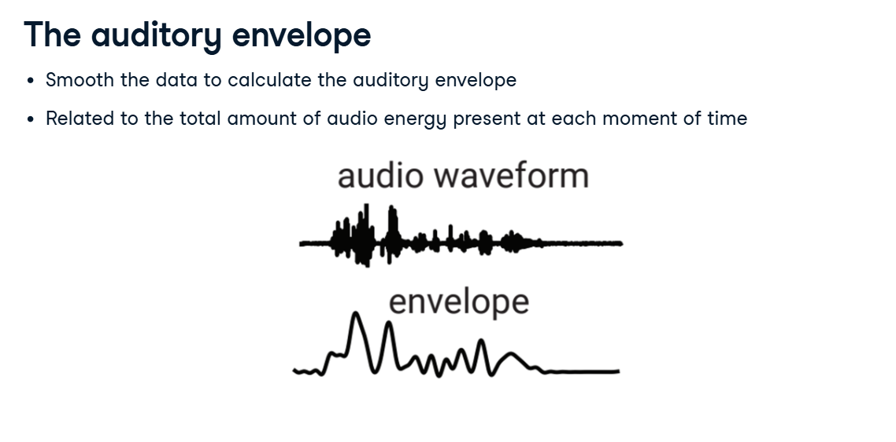

# Audio Envelopes & Cross-Validation

If we look at a raw audio waveform (like a recorded heartbeat), it looks like a crazy, scribbly line bouncing rapidly above and below zero.

Because it bounces so fast, taking the "average" of the raw line isn't always the best representation of the sound. Instead, we want to look at the Auditory Envelope—the smooth, overarching shape of the sound wave.

Here is the 2-step process to transform a jagged sound wave into a smooth envelope!

## 1. Step 1: Rectification (Absolute Value)

*(See your first graph)*


The raw audio wave dips deep into the negative numbers and shoots high into the positive numbers.

If you average positive and negative numbers together, they cancel each other out and equal zero! We don't want that. We want to measure the total energy of the sound.

**The Fix:** We "rectify" the signal. This just means we take the Absolute Value of every number. All the negative dips are flipped upwards to become positive bumps.

**The Code:** `audio_rectified = audio.apply(np.abs)`

**The Result:** 
*(See your second graph)*


There are no more negative numbers; the entire wave sits above the zero line!

## 2. Step 2: Smoothing (The Rolling Window)

Even though our wave is entirely positive now, it is still incredibly spiky and jagged. We need to smooth it out.

We do this using a Rolling Window.

**How it works:** Imagine a tiny window that only looks at 50 data points at a time. It calculates the average of those 50 points, plots a single dot, and then slides forward by one point.

**The Result:** Because it is constantly averaging small chunks of time, the jagged spikes are completely smoothed out into gentle hills. 

*(See your Smoothing your data screenshot to see the "Before and After" of a rolling window!)*


**The Python Code:**

```python
# 1. Take the absolute value (Rectify)
audio_rectified = audio.apply(np.abs)

# 2. Smooth it out by taking the average of every 50 samples!
audio_envelope = audio_rectified.rolling(50).mean()
```

*(See your final graph)*


We have successfully created a beautiful, smooth Auditory Envelope that perfectly traces the heavy "thumps" of the heartbeat!

## 3. Extracting the Final Features

Now that we have a clean, smooth envelope, we can go back to our standard feature engineering process.

Just like we did in the last lesson, we calculate the summary statistics (Mean, Standard Deviation, and Max), but this time we calculate them on the Envelope instead of the raw audio!

```python
import numpy as np

# Calculate our 3 features based on the new, smoothed envelope
envelope_mean = np.mean(audio_envelope, axis=0)
envelope_std = np.std(audio_envelope, axis=0)
envelope_max = np.max(audio_envelope, axis=0)

# Glue them together into a 2D grid for Scikit-Learn!
X = np.column_stack([envelope_mean, envelope_std, envelope_max])

# Reshape the labels to make sure they are in the correct (samples, 1) format
y = labels.reshape(-1, 1)
```

## 4. Grading the Model: Cross-Validation

We finally have our `X` (Features) and `y` (Labels). It is time to train and grade the model!

Instead of doing a simple `train_test_split`, professional data scientists use Cross-Validation to get a much more reliable grade.

**How it works:** Instead of cutting the data in half once, `cross_val_score` cuts the data into multiple chunks (e.g., `cv=3` means 3 chunks). It trains the model on two chunks and tests it on the third. Then it rotates and does it again, testing every single chunk!

*(See your Cross-Validation screenshot)*


```python
from sklearn.model_selection import cross_val_score
from sklearn.svm import LinearSVC

# 1. Instantiate the model
model = LinearSVC()

# 2. Run Cross-Validation! 
# (This automatically splits the data, fits the model, and scores it 3 separate times!)
scores = cross_val_score(model, X, y, cv=3)

print(scores)
# Output: [0.609, 0.599, 0.614]
```

**The Verdict:** The model scored around 60% accuracy across all three tests. Because we used cross-validation, we can be highly confident that this model will perform at ~60% accuracy in the real world!
