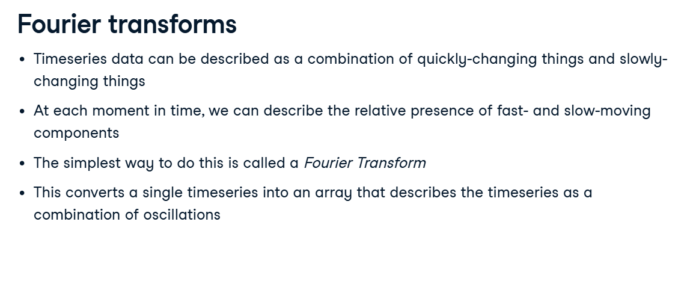
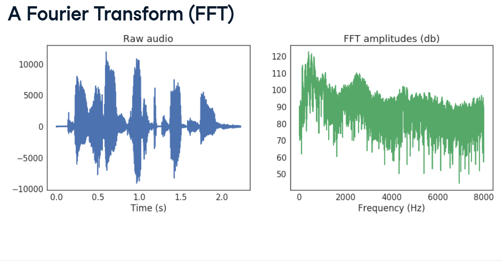
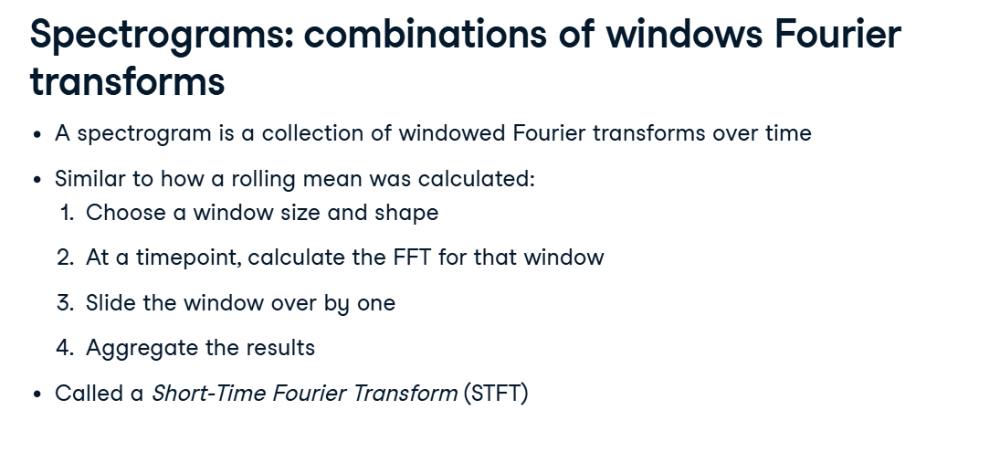
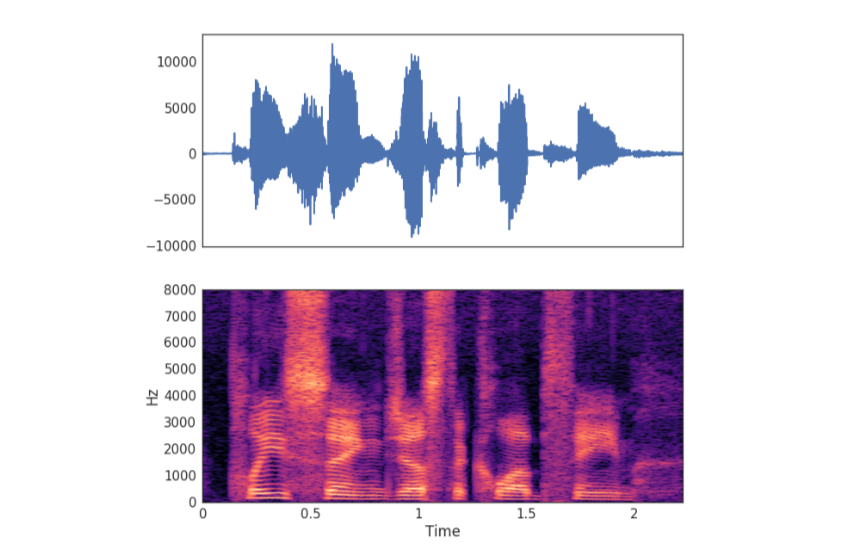
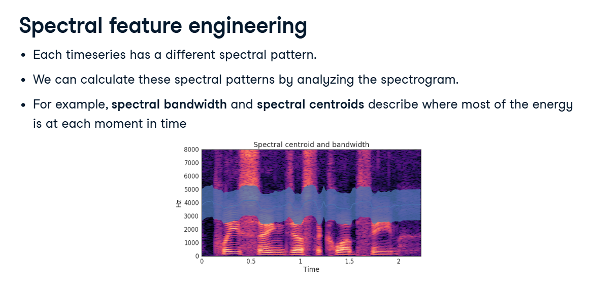

# Spectrograms & Spectral Features

In our previous lessons, we summarized audio by looking at its volume over time (the Auditory Envelope). We calculated the max volume, the average volume, etc.

But volume is only half the story. What about the pitch? A high-pitched scream and a low-pitched bass drum might have the exact same volume, but they mean completely different things!

To capture this information, we have to look at the Spectral (frequency) changes.

## 1. The Fourier Transform (Un-blending the Smoothie)

*(Look at your first two screenshots)*



To a computer, a raw audio wave is incredibly messy. It is a combination of fast-moving waves (high pitches/treble) and slow-moving waves (low pitches/bass) all smashed together.

**The Analogy:** Imagine taking a strawberry, a banana, and some milk, and blending them together into a smoothie. If you hand that smoothie to a computer, it can't easily tell you what's inside.

**The Fourier Transform (FFT):** This is a magical mathematical tool that un-blends the smoothie. It takes the messy raw audio and perfectly separates it into its base ingredients.

**The Result:** Look at the right side of the *A Fourier Transform* image. The FFT creates a graph showing exactly how much bass (slow waves on the left) and how much treble (fast waves on the right) is in the sound!

## 2. The Spectrogram (Adding Time Back In)

There is a problem with standard FFT. When it un-blends the entire audio file at once, it loses track of time. It tells you that there was a high-pitch scream somewhere in the file, but it can't tell you when it happened!

To fix this, we use a Spectrogram (Short-Time Fourier Transform, or STFT).

*(Look at the Spectrograms: combinations of windows screenshot)*


**How it works:** Instead of un-blending the whole file at once, we use a Rolling Window (just like we did for the auditory envelope). We take a tiny 1/10th of a second window, un-blend it, record the frequencies, and move forward.

**The Visual Result:** We have created a Heatmap!

*   **X-Axis:** Time.
*   **Y-Axis:** Frequency (Pitch - Bass at bottom, Treble at top).
*   **Color:** How loud that specific pitch was at that exact millisecond (bright orange means very loud!).

## 3. Calculating the STFT in Python

*(Look at the Calculating the STFT with code image)*


Here is how we generate that Heatmap using librosa.

```python
from librosa.core import stft, amplitude_to_db

# 1. Calculate the STFT
# hop_length is how far the window slides forward.
# n_fft is the size of the rolling window.
audio_spec = stft(audio, hop_length=16, n_fft=128)

# 2. Convert to Decibels
# Raw math amplitude is hard to read. We convert it to standard Decibels (db)
# so it matches how human ears actually hear volume!
spec_db = amplitude_to_db(audio_spec)
```

## 4. Spectral Feature Engineering

Now we have a beautiful Spectrogram heatmap. But remember: machine learning models like LinearSVC expect simple 2D spreadsheets (samples, features). We can't feed it a complex image easily.

Just like we summarized the raw audio wave with Mean and Max, we need to summarize the Spectrogram!

*(Look at the Spectral feature engineering images)*


We ask librosa to calculate summary statistics for the frequencies at every moment in time:

*   **Spectral Centroid:** Where is the "center of mass" of the sound? (e.g., Is the sound mostly bassy, or mostly high-pitched overall?).
*   **Spectral Bandwidth:** How spread out is the sound? (e.g., Is it a pure, single piano note, or is it white noise spanning all frequencies?).

## 5. The Ultimate Classifier Matrix

Now we have the ultimate set of clues! We have temporal (time/volume) features from our last lesson, and spectral (pitch/frequency) features from this lesson.

We calculate the means of all these new spectral features, and use our trusty `np.column_stack` tool to glue EVERYTHING together into one massive, super-smart dataset for Scikit-Learn!

```python
# Glue the volume features and the pitch features together into one massive X matrix!
X = np.column_stack([
    means, stds, maxs,             # Raw volume stats
    tempo_mean, tempo_max, tempo_std, # Tempo/Speed stats
    bandwidths_all, centroids_all     # Spectral/Pitch stats!
])
```

By giving the model all of these diverse features, its classification accuracy will absolutely skyrocket!
