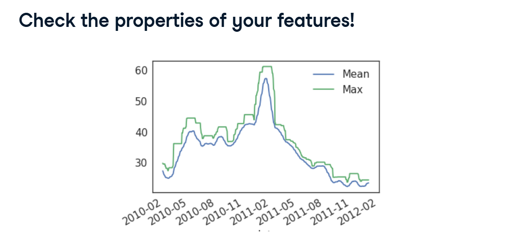
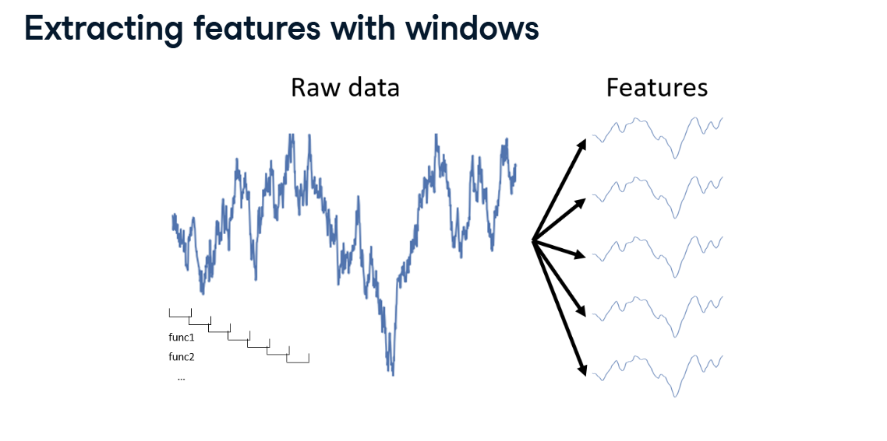

# Feature Extraction Over Time

In our last few lessons, we learned how to clean messy time series data by smoothing it out with a Rolling Window.

But rolling windows aren't just for cleaning data; they are incredible tools for Feature Extraction! Instead of just finding the average of a 20-day window, what if we extracted the maximum value, the variance, and the percentiles all at the same time?

Here is how we generate multiple features over time to make our machine learning models incredibly smart.

## 1. Extracting Multiple Features (.aggregate)

We take the raw, squiggly line and run a rolling window over it. But instead of just calculating one thing, we calculate completely different mathematical functions, creating brand new feature columns!

**How to do it in Pandas:**
Pandas has a magical method called `.aggregate()` (or `.agg()`). You simply hand it a list of the mathematical functions you want to run!



```python
import numpy as np

# 1. Create a 20-day rolling window
# 2. Tell it to calculate BOTH the Standard Deviation (np.std) AND the Maximum (np.max)
feats = prices.rolling(20).aggregate([np.std, np.max]).dropna()

print(feats.head())
```

**The Result:** Pandas automatically creates two brand new columns for every stock in your dataset: `std` and `amax` (the maximum).

Always plot your new features! If you plot the Rolling Mean vs. the Rolling Max, you can visually see that the Max (the green line) is much jumpier and reacts faster to spikes than the Mean (the blue line). Both give the model totally different, useful clues!

## 2. The Python Shortcut: partial()

Sometimes, a mathematical function requires extra instructions.
For example, if you want to calculate the Mean down a specific axis, you have to type `np.mean(a, axis=0)`.

**The Problem:** The Pandas `.aggregate()` tool only accepts the name of a function (like `np.mean`). It doesn't easily let you pass those extra instructions (like `axis=0`) inside the brackets.

**The Fix:** We use Python's `partial` tool!



Think of `partial` like pre-setting your microwave. You program the time and power level in advance, so later you just have to press one single button to start it.

`partial(np.mean, axis=0)` creates a brand new, pre-packaged function that will always remember to use `axis=0`.

## 3. Extracting Percentiles

The "Mean" (Average) is great, but it hides outliers. A much better way to summarize data is using Percentiles.
*(e.g., The 20th percentile tells you exactly what number is higher than the bottom 20% of your data).*

We want to extract three different percentiles (the 20th, 40th, and 60th) for our rolling window. We can use our partial trick to build them!

```python
from functools import partial
import numpy as np

# 1. Create a list of 3 pre-packaged functions using a loop!
# This builds: [np.percentile(q=20), np.percentile(q=40), np.percentile(q=60)]
percentile_funcs = [partial(np.percentile, q=ii) for ii in [20, 40, 60]]

# 2. Pass that list of functions directly into .aggregate()
# This instantly generates 3 brand new columns for our model!
data.rolling(20).aggregate(percentile_funcs)
```

## 4. Engineering Date-Based Features

Finally, we cannot forget about time itself!

If you are trying to predict how many customers will visit a restaurant, the raw date "2017-01-01" is useless. The most important clue is probably: "Is it the weekend?"

Because we successfully converted our Pandas index into proper datetime objects in a previous lesson, we have access to incredible hidden features!

```python
# Extract the numeric day of the week (0 = Monday, 6 = Sunday)
day_of_week_num = prices.index.weekday

# Extract the actual text name of the day!
day_of_week = prices.index.day_name()
```

By extracting these "Date-Based" features, the model can finally learn behavioral patterns (like noticing that restaurant sales always spike on Fridays!).
