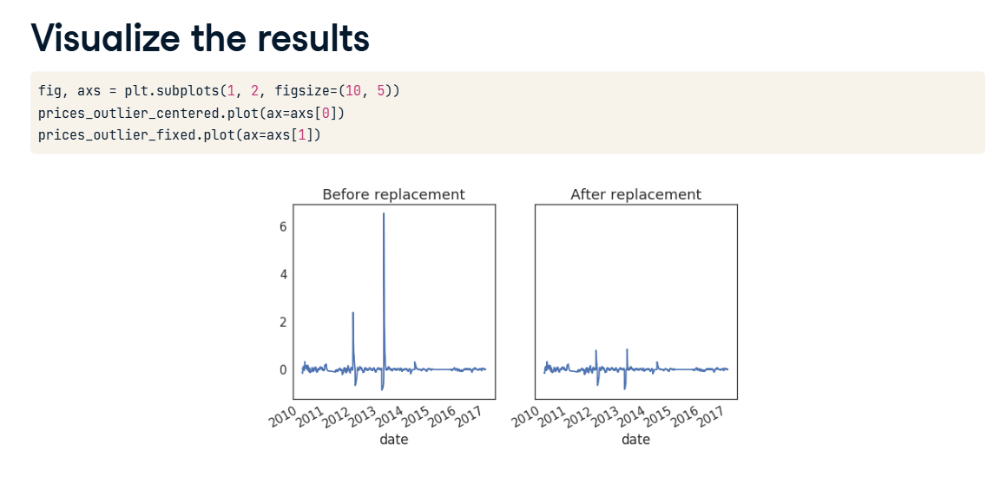
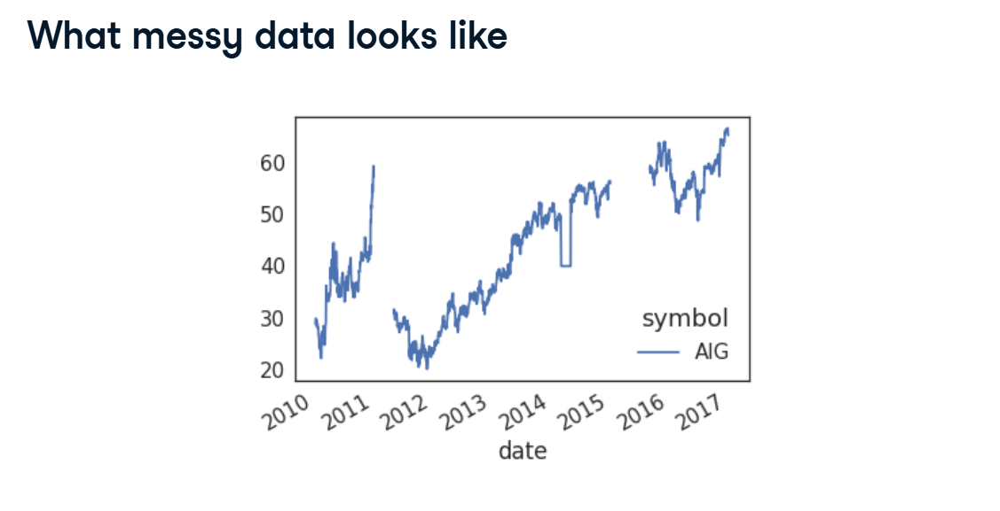
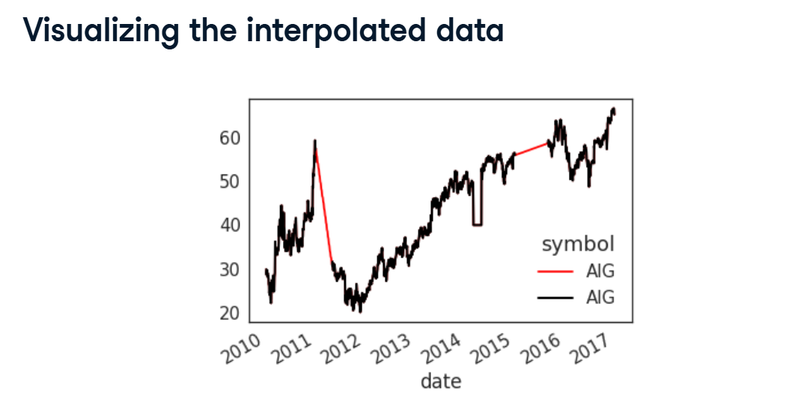
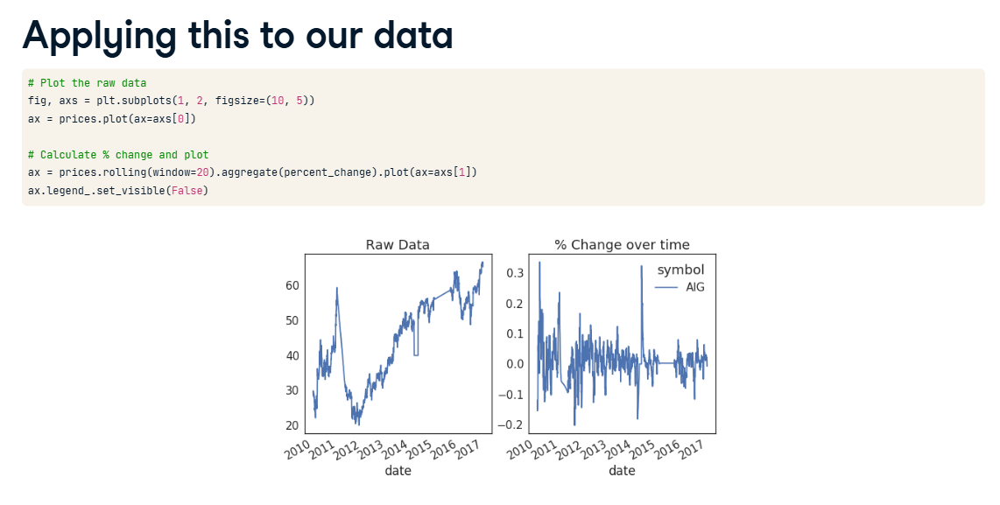
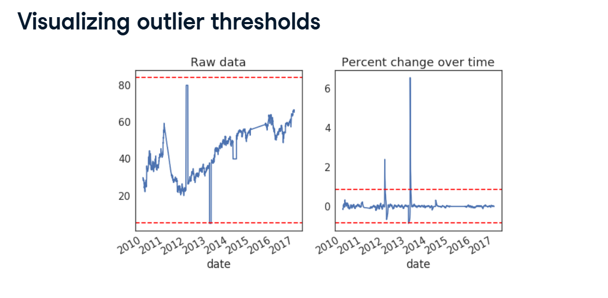

# Cleaning Time Series Data

In the real world, data is never perfect. Sensors temporarily lose power, and humans make typos.

If you look at the raw AIG stock chart in your first screenshot (What messy data looks like), it has massive blank gaps where no data was recorded, and strange, unnatural flatlines.



If we feed this garbage into a machine learning model, the model will output garbage. Here are the three steps to clean it up!

## 1. Filling the Gaps (Interpolation)

If a sensor turns off for a week, you'll have a massive blank gap in your timeline. You can't just delete those rows, because in Time Series data, the continuous flow of time is strictly required!

**The Fix:** We use Interpolation.
Imagine you are walking up a hill. You know you were at 10 feet of elevation at 1:00 PM, and 20 feet of elevation at 3:00 PM. If your watch broke at 2:00 PM, you can safely assume you were probably around 15 feet high.

You just draw a straight line between the known points to fill the gap!

**The Pandas Code:**



```python
# Tell Pandas to find the blank gaps and draw a straight 'linear' line between the edges!
prices_interp = prices.interpolate('linear')
```

**Visual Result:** If you look at the Visualizing the interpolated data screenshot, you can see the bright red line where the computer successfully bridged the massive gap in the AIG stock data!

## 2. Standardizing the Data (Rolling Percent Change)

Look at the Raw Data graph in the Applying this to our data screenshot. The stock price drifts way up and way down over the years.



Because the raw prices change so drastically over time, it is really hard for a model to compare a stock jump in 2011 to a stock jump in 2016.

**The Fix:** Instead of feeding the model the raw price, we feed the model the Percent Change.
We use a Rolling Window to look at the last 20 days, and ask: "Compared to the last 3 weeks, did today's price spike up or drop down?"

**Visual Result:** Look at the % Change over time graph next to the raw data. By making this change, the massive, drifting mountain of data is flattened into a tight, consistent seismograph centered perfectly around 0.0!

## 3. Hunting Outliers (The 3-Sigma Rule)

Now that our data is perfectly centered around 0.0, we can easily spot glitches.

Look at the % Change graph again. Right around 2014, there is a massive spike that shoots all the way up to 6.0! That means the stock jumped 600% in a single day. This is almost certainly a data glitch.

How to catch them automatically:
We calculate the Standard Deviation (the average spread of the data). A famous rule in statistics states that 99.7% of all normal data will fall within 3 Standard Deviations of the average.

Anything outside of that is an Outlier (a glitch).



```python
# Calculate the mean and the standard deviation
this_mean = data.mean()
this_std = data.std()

# Draw a red line at (Mean + 3 Standard Deviations)
ax.axhline(this_mean + this_std * 3, color='r')
```

## 4. Fixing the Outliers (Median Replacement)

Once we find these glitches, what do we do with them?

Again, we can't delete them because we need the flow of time to stay perfectly intact. We have to replace them with a safe, boring number.

**The Fix:** We replace them with the Median.



```python
import numpy as np

# 1. Find all the dots that are larger than (3 * Standard Deviation)
outliers = np.abs(prices_outlier_centered) > (std * 3)

# 2. Replace those exact dots with the median of the dataset!
prices_outlier_fixed[outliers] = np.nanmedian(prices_outlier_fixed)
```

**The Final Result:**
Look at the final Visualize the results screenshot. The crazy 600% spike has been magically erased and replaced with a normal, boring baseline number. Our Time Series is completely clean, gap-free, and ready for Machine Learning!
