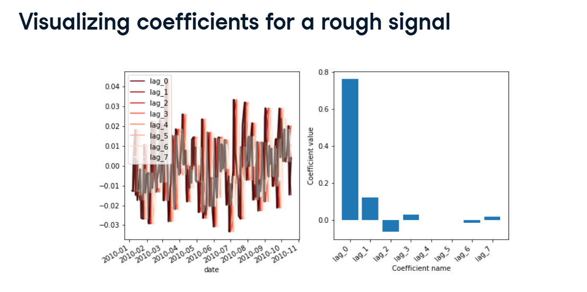
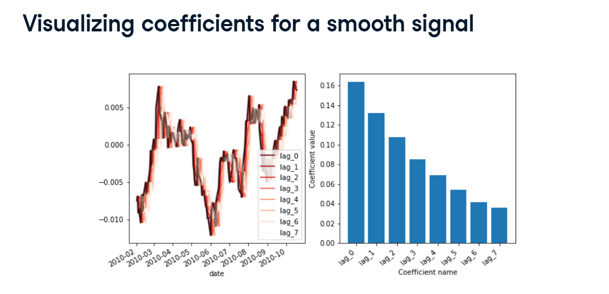

# Auto-Regressive Models & Time Lags

In normal machine learning, you predict a house's price based on its features (bedrooms, bathrooms).

In Time Series, the best feature you can possibly use to predict a stock's price today is... the stock's price yesterday. Because time series data flows in order, it often has Autocorrelation (meaning the data is correlated with older versions of itself). Here is how we exploit that using an Auto-Regressive model!

## 1. Creating Time-Lagged Features (.shift())

To teach a model to look into the past, we have to physically slide the data downward so that "Yesterday's" data sits right next to "Today's" data in the spreadsheet.

Look at your first screenshot (Time-shifting data with Pandas).
We use the Pandas `.shift()` method to do this!



Raw Data: `[0.0, 1.0, 2.0, 3.0, 4.0]`

`df.shift(3)`: Moves everything 3 steps into the past! The first three rows become blank (NaN), and the data now looks like: `[NaN, NaN, NaN, 0.0, 1.0]`.

By looping this (as seen in your Creating a time-shifted DataFrame screenshot), we can instantly create 7 brand new columns: `lag_1`, `lag_2`, `lag_3`, etc. We have essentially given our model a 7-day memory!



## 2. Fitting the Auto-Regressive Model

"Auto" means Self. "Regression" means predicting a number.
An Auto-Regressive model is simply a model that predicts its own future using its own past!

Look at the Fitting a model with time-shifted features screenshot.
Because our `many_shifts` DataFrame is perfectly formatted as a standard 2D grid, we can just feed it into a normal Scikit-Learn Ridge Regression model!

```python
from sklearn.linear_model import Ridge

model = Ridge()
# Predict the current 'data' using the past 'many_shifts'
model.fit(many_shifts, data)
```

## 3. Interpreting the Coefficients (Smooth vs. Rough)

Once the model is trained, we can look inside its "brain" by checking its coefficients (`model.coef_`). This tells us exactly which days in the past were the most helpful for predicting the future.

### Scenario A: A Rough, Noisy Signal

Look at your Visualizing coefficients for a rough signal screenshot.

**The Data (Left):** The line graph is incredibly jagged, random, and spiky.

**The Brain (Right):** Look at the bar chart! The model gave a massive coefficient to `lag_0` (the immediate present/past), but every single other lag (`lag_1` through `lag_7`) dropped instantly to zero.

**The Verdict:** The data is so chaotic that looking 3 or 4 days into the past is completely useless. Only the most immediate information matters.

### Scenario B: A Smooth, Flowing Signal

Look at your final Visualizing coefficients for a smooth signal screenshot.

**The Data (Left):** The line graph moves in smooth, gentle, rolling waves.

**The Brain (Right):** Look at the bar chart now! It looks like a beautiful staircase. `lag_0` is the most important, but `lag_1`, `lag_2`, and `lag_3` also have very strong, positive coefficients that slowly fade away.

**The Verdict:** Because the data moves smoothly, a trend from 4 days ago still has a strong, lingering mathematical impact on what happens today!
