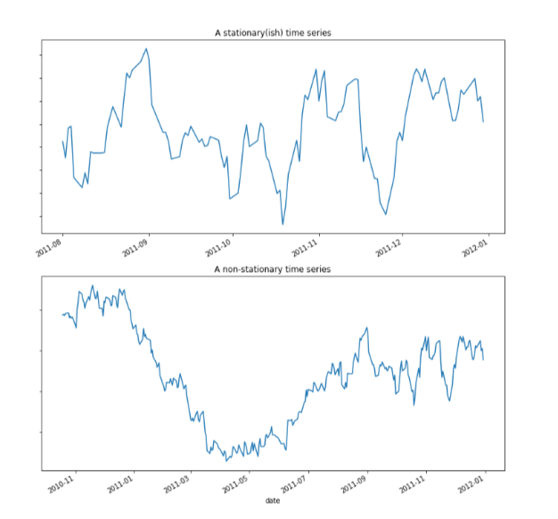
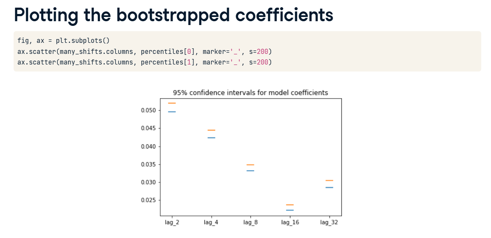
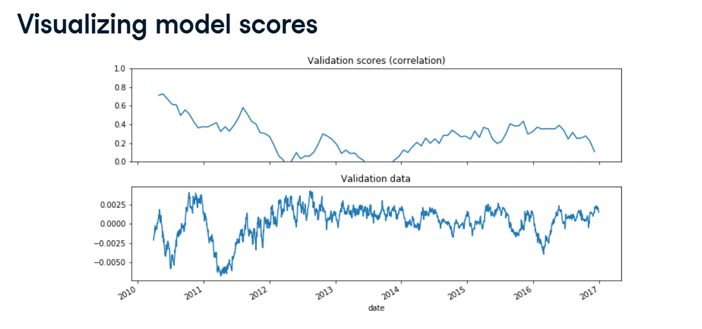
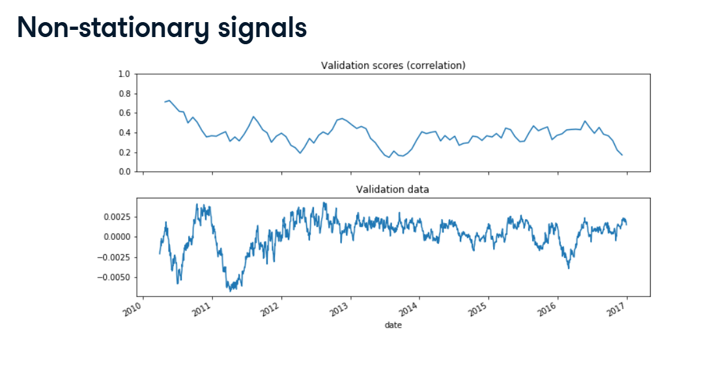

# Stationarity & Model Stability

In standard machine learning, we assume the rules of the world never change. If a 3-bedroom house costs $300k today, the model assumes it will cost $300k ten years from now.

But with Time Series data, the rules of the world change constantly. This brings us to a critical concept: Stationarity.

## 1. What is Stationarity?

*   **Stationary Data (Top Graph):** The data looks like a consistent, even heartbeat. Its average (mean) and its spread (variance) stay exactly the same forever. The rules never change.
*   **Non-Stationary Data (Bottom Graph):** The data grows wildly, changing its trend and spreading out more over time. The rules are constantly changing.

**The hard truth:** Almost all real-world data (like the stock market, weather, or sales) is Non-Stationary!

## 2. The Danger: Model Instability

If you train a model on data from 2010 to 2015, it memorizes the "rules" of that era.
If the data is non-stationary, by the time 2018 rolls around, the world has changed. The model will try to predict 2018 using 2010's rules, and it will fail miserably! We call this an Unstable Model.

## 3. Diagnosing Instability (Bootstrapping)

How do we know if our model is suffering from instability? We use Cross-Validation to look at the model's coefficients (its "brain" weights) over time. If the coefficients are jumping around wildly from fold to fold, our data is unstable!

To measure exactly how wildly they are jumping, we use **Bootstrapping**.

*   **What is it?** We randomly sample the model's coefficients hundreds of times (with replacement) and calculate the average.
*   **Confidence Intervals:** We want to know the "safe range" of these coefficients. Look at your Bootstrapping the mean screenshot. We calculate the 2.5 percentile (the lower bound) and the 97.5 percentile (the upper bound).

*   **The Result:** This creates a 95% Confidence Interval. Look at your Plotting the bootstrapped coefficients bar chart! The black error bars show you exactly how much the model's brain is fluctuating. If those error bars are massive, your model is highly unstable!

## 4. Visualizing Performance Over Time

Instead of just looking at coefficients, what if we just look at the model's test scores over time?

Because we use `TimeSeriesSplit` (the staircase method), we can actually plot our model's accuracy on a timeline!

*   **The Warning Sign:** In the screenshot, the model was doing great, but suddenly took a massive "dip" in the middle of the timeline.
*   **The Diagnosis:** The statistics of the data changed abruptly at that exact moment in time. The model was confused because it was applying old, outdated rules to a new, shifted reality.

## 5. The Fix: Fixed Training Windows

If the world keeps changing, how do we fix our model?

We force the model to forget the distant past!

If you are trying to predict the stock market today, what happened 10 years ago is probably completely irrelevant and distracting. You only want the model to study the last 30 days.

*   **The Code:** You pass `max_train_size` into your `TimeSeriesSplit`.
*   **What it does:** Instead of an endlessly growing staircase (where the model is forced to remember all of history), you restrict the window size. The model is only allowed to train on the most recent block of data before making its next prediction.

By restricting the training window, the model constantly adapts to the "new normal", skipping the massive performance dips caused by non-stationary data!
