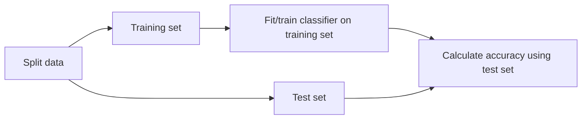

# Measuring model performance

## 1. Measuring model performance
Now we can make predictions using a classifier, but how do we know if the model is making correct predictions? We can evaluate its performance!

## 2. Measuring model performance
In classification, accuracy is a commonly-used metric. Accuracy is the number of correct predictions divided by the total number of observations.

## 3. Measuring model performance
How do we measure accuracy? We could compute accuracy on the data used to fit the classifier. However, as this data was used to train the model, performance will not be indicative of how well it can generalize to unseen data, which is what we are interested in!

## 4. Computing accuracy
It is common to split data into a training set and a test set.

## 5. Computing accuracy
We fit the classifier using the training set,

## 6. Computing accuracy
then we calculate the model's accuracy against the test set's labels.



## 7. Train/test split
To do this, we import `train_test_split` from `sklearn.model_selection`. We call `train_test_split`, passing our features and targets. We commonly use 20-30% of our data as the test set. By setting the `test_size` argument to `0.3` we use 30% here. The `random_state` argument sets a seed for a random number generator that splits the data. Using the same number when repeating this step allows us to reproduce the exact split and our downstream results. It is best practice to ensure our split reflects the proportion of labels in our data. So if churn occurs in 10% of observations, we want 10% of labels in our training and test sets to represent churn. We achieve this by setting `stratify` equal to `y`. `train_test_split` returns four arrays: the training data, the test data, the training labels, and the test labels. We unpack these into `X_train`, `X_test`, `y_train`, and `y_test`, respectively. We then instantiate a KNN model and fit it to the training data using the `.fit()` method. To check the accuracy, we use the `.score()` method, passing `X_test` and `y_test`. The accuracy of our model is 88%, which is low given our labels have a 9 to 1 ratio.

```python
from sklearn.model_selection import train_test_split
X_train, X_test, y_train, y_test = train_test_split(X, y, test_size=0.3, 
                                                    random_state=21, stratify=y)
knn = KNeighborsClassifier(n_neighbors=6)
knn.fit(X_train, y_train)
print(knn.score(X_test, y_test))
```
**Output:**
```text
0.8800599700149925
```

## 8. Model complexity
Let's discuss how to interpret k. Recall that we discussed decision boundaries, which are thresholds for determining what label a model assigns to an observation. In the image shown, as k increases, the decision boundary is less affected by individual observations, reflecting a simpler model. Simpler models are less able to detect relationships in the dataset, which is known as underfitting. In contrast, complex models can be sensitive to noise in the training data, rather than reflecting general trends. This is known as overfitting.

* **Larger k** = less complex model = can cause underfitting
* **Smaller k** = more complex model = can lead to overfitting

## 9. Model complexity and over/underfitting
We can also interpret k using a model complexity curve. With a KNN model, we can calculate accuracy on the training and test sets using incremental k values, and plot the results. We create empty dictionaries to store our train and test accuracies, and an array containing a range of k values. We use a for loop to repeat our previous workflow, building several models using a different number of neighbors. We loop through our neighbors array and, inside the loop, we instantiate a KNN model with `n_neighbors` equal to the neighbor iterator, and fit to the training data. We then calculate training and test set accuracy, storing the results in their respective dictionaries.

```python
train_accuracies = {}
test_accuracies = {}
neighbors = np.arange(1, 26)
for neighbor in neighbors:
    knn = KNeighborsClassifier(n_neighbors=neighbor)
    knn.fit(X_train, y_train)
    train_accuracies[neighbor] = knn.score(X_train, y_train)
    test_accuracies[neighbor] = knn.score(X_test, y_test)
```

## 10. Plotting our results
After our for loop, we then plot the training and test values, including a legend and labels.

```python
plt.figure(figsize=(8, 6))
plt.title("KNN: Varying Number of Neighbors")
plt.plot(neighbors, train_accuracies.values(), label="Training Accuracy")
plt.plot(neighbors, test_accuracies.values(), label="Testing Accuracy")
plt.legend()
plt.xlabel("Number of Neighbors")
plt.ylabel("Accuracy")
plt.show()
```

## 11. Model complexity curve
Here's the result! As k increases beyond 15 we see underfitting where performance plateaus on both test and training sets, as indicated in this plot.

## 12. Model complexity curve
The peak test accuracy actually occurs at around 13 neighbors.

## 13. Understanding Accuracy Deep Dive
To understand Accuracy in classification, it helps to think of it exactly like grading a multiple-choice exam. It is the simplest and most intuitive way to evaluate how well a machine learning model is performing.

### The Basic Formula
At its core, accuracy is just a ratio:
\[Accuracy = \frac{Correct\ Predictions}{Total\ Predictions}\]

If your model analyzes 100 emails and correctly identifies 90 of them (whether they are spam or not spam), the accuracy is 90%.

### Breaking it Down: The Confusion Matrix
In machine learning, we usually break these "correct" and "incorrect" predictions down into four distinct categories to truly understand where the model is succeeding or failing. This is mapped out in a **Confusion Matrix**:

* **True Positives (TP)**: The model correctly predicted the positive class (e.g., predicted Spam, and it was Spam).
* **True Negatives (TN)**: The model correctly predicted the negative class (e.g., predicted Not Spam, and it was Not Spam).
* **False Positives (FP)**: The model incorrectly predicted the positive class (e.g., predicted Spam, but it was actually an important work email).
* **False Negatives (FN)**: The model incorrectly predicted the negative class (e.g., predicted Not Spam, but it was actually a malicious phishing link).

When you build models from scratch or use libraries like scikit-learn, the accuracy formula using these terms becomes:
\[Accuracy = \frac{TP + TN}{TP + TN + FP + FN}\]

### The "Trap" of Accuracy (Imbalanced Data)
While accuracy is a great starting metric, it can be highly misleading if your dataset is imbalanced.

Imagine you are building an Intrusion Detection System for a network:
* 99% of the network traffic is normal.
* 1% of the network traffic is a malicious attack.

If you write a "dumb" model that simply predicts "Normal" 100% of the time, without actually doing any learning, it will be correct 99 times out of 100.

Its Accuracy is 99%. However, the model is completely useless because it failed to detect the 1% of traffic that actually mattered (the attack). Because of this, data scientists often look at other metrics—like Precision, Recall, and F1-Score—when dealing with imbalanced datasets.
